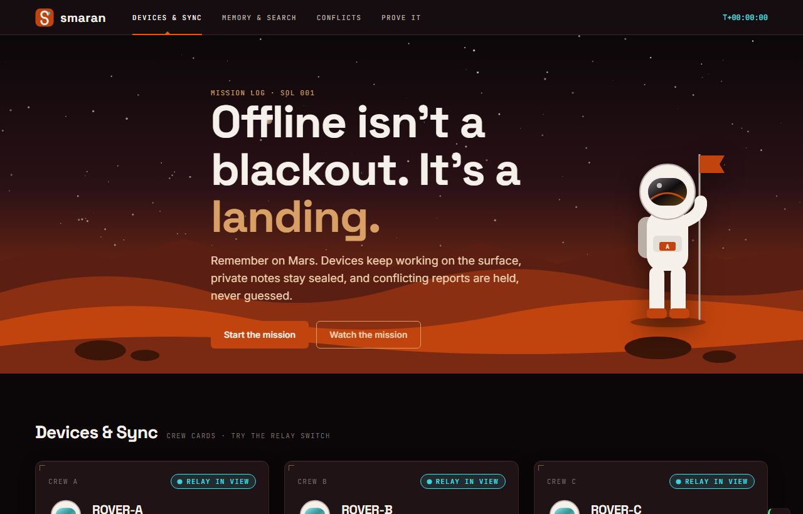
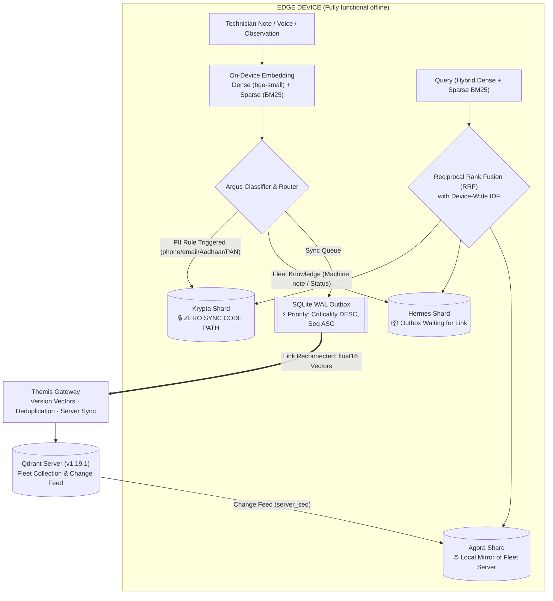
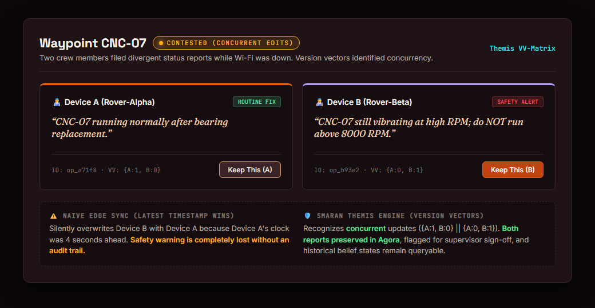

#  Smaran (ΣMARAN)

[](https://github.com/SanTiwari07/Smaran/actions/workflows/ci.yml)
[](LICENSE)
[](#prove-it-in-60-seconds)
[](https://qdrant.tech/documentation/edge/)
[](https://qdrant.tech/)
[](#measured-results)

**Offline-first memory and intelligence for edge fleets.** It keeps working when the network vanishes, seals private notes on-device by construction, and uses mathematical version vectors to flag clashing field reports instead of silently dropping one.

Built on **Qdrant Edge** (on every device) and **Qdrant Server** (the fleet hub), for **Code Cubicle 6.0, Problem Statement 3 (AI-Powered Edge Memory & Intelligence Platform)**, hosted by **Geek Room** and owned by **Qdrant**.

---

<p align="center">
  <a href="story/index.html"><b>📖 Interactive Story Walkthrough</b></a> ·
  <a href="docs/ARCHITECTURE.md"><b>🏛️ Architecture Deep-Dive</b></a> ·
  <a href="docs/BENCHMARKS.md"><b>📊 Measured Benchmarks</b></a> ·
  <a href="docs/DEMO.md"><b>🎬 Presenter Script</b></a> ·
  <a href="#team-and-license"><b>👥 The Team</b></a>
</p>

---

## 📸 Mission Control Interface

<p align="center">
  
</p>

> *"Offline isn't a blackout. It's a landing."*
> Above: **Olympus Mission Control** monitoring edge rovers, three-shard memory lanes, telemetry link toggles, and live search scanning on pure local hardware.

---

## 📖 The Story of Smaran

### Act I: The Edge Disconnect (Sol 001)

Imagine two maintenance technicians—or two planetary rovers—dispatched into a network dead-zone (a steel-reinforced factory basement, a remote mine, or the Martian surface). 

Standard edge systems fail immediately:
1. Cloud-dependent agents go dark when Wi-Fi drops.
2. Local vector databases dump everything into a flat, unsynchronized store.
3. When the connection flickers back, standard sync engines rely on **timestamps (Last-Write-Wins)**. If Device A and Device B made conflicting observations while disconnected, **one report is silently destroyed**, and skewed device clocks can cause the wrong report to win.

**Smaran solves this by treating offline not as an error condition, but as the default operating environment.**

---

### Act II: The Three-Shard Vault

Every device running Smaran hosts three isolated on-device **Qdrant Edge** shards (`qdrant-edge-py==0.8.0`) paired with FastEmbed CPU embeddings (`bge-small-en-v1.5`, 384-d) and native sparse BM25 tokenizers:



1. **🔒 Krypta (Private by Construction)**: 
   - A dedicated Edge Shard designed with **zero synchronization code paths**.
   - Deterministic Indian PII regex filters (mobile numbers, emails, Aadhaar, PAN) force private records into Krypta. No AI model or prompt can override these structural boundaries.
   - Gateway re-verification and server audits prove **0 private records leak to the cloud**.
2. **📦 Hermes (Mutable Edge Outbox)**: 
   - Captures shareable edge memories and writes them into an ACID-compliant SQLite WAL outbox before touching memory.
   - Safety-critical alerts are prioritized (`criticality DESC`) when bandwidth is constrained.
3. **🌐 Agora (Fleet Mirror on Edge)**: 
   - A local read mirror of Qdrant Server continuously refreshed via lightweight change feeds, providing immediate low-latency local context with device-wide inverse document frequency (IDF).

---

### Act III: The Clashing Truth (Version Vectors)

<p align="center">
  
</p>

When two disconnected devices edit the same entity or waypoint while out of touch:
- **What reference architectures do**: Compare timestamps. The device with clock drift overwrites the other. A critical safety hazard warning ("*Motor smoking, emergency stop pressed*") can be erased by an outdated "*Running normal*" note.
- **What Smaran does**: Tracks causality using **Themis Version Vectors** (`{A: 1, B: 0} || {A: 0, B: 1}`). Concurrent writes are detected as mathematically incomparable, stored side-by-side as `contested`, and preserved in historical belief records. A human supervisor resolves the dispute, and the resolution becomes a causal successor that supersedes both.

---

### Act IV: The Personal Companion (Memory That Knows *Why*)

Sitting on top of the edge storage is an explainable personal companion agent (`backend/companion/`):
- **Decision Memory**: Records the rationale in the user's exact words along with evidence and provenance. Asking *"Why did we choose PostgreSQL?"* answers directly from structured historical rationale.
- **Contradiction Detection**: If you state *"Let's switch to MongoDB"*, Smaran does not silently overwrite PostgreSQL. It halts, flags a pending contradiction, and prompts for explicit confirmation.
- **Explainable Provenance**: Every retrieved memory and synthesized answer carries a deterministic provenance score and link audit trace (`GET /companion/memory/explain`).
- **Local SLM with Rules Fallback**: Runs on a local 3B model (Ollama `llama3.2`) when available, falling back seamlessly to deterministic rule extractors if the model runtime is absent.

---

## ⚡ Measured Results

All metrics are experimentally measured on project data on local commodity hardware. See [docs/BENCHMARKS.md](docs/BENCHMARKS.md) and [docs/EDGE_BENCHMARKS.md](docs/EDGE_BENCHMARKS.md).

| Metric | Target | Measured Result | Verification Command |
|---|---|---|---|
| **Offline Hybrid Search Latency** (2,000 points, 3 shards) | < 20 ms p50 | **3.04 ms p50 / 3.98 ms p95** | `python -m bench.bench latency` |
| **Retrieval Quality** (40 Golden Queries, MRR / Hit@5) | > 0.90 | **Hit@5: 0.975** (Hybrid) vs 0.95 (Dense) / 0.95 (BM25) | `python -m bench.retrieval` |
| **Conflict Detection** (50 test scenarios with clock drift) | > 80% | **Themis: 50 / 50 (100%)** vs Naive LWW: 13 / 50 (26%) | `python -m bench.bench conflicts` |
| **Multi-Device Convergence** (5-device simulation) | 100% | **1,000 / 1,000 runs converged identically** | `python -m bench.bench convergence` |
| **Bandwidth Reduction** vs full sync baseline | > 40% | **85.7% total bandwidth saved** (float16 transport) | `python -m bench.bench bandwidth` |
| **Crash Durability** (Hard SIGKILL during sync push) | Zero data loss | **3 of 3 ops recovered, 0 duplicate memories** | `python scripts/demo.py play b5` |
| **Privacy Leakage to Cloud** | 0 records | **0 private records · 0 PII leaks** verified by gateway audit | `curl http://127.0.0.1:8000/audit` |
| **Integration Test Suite** | 100% pass | **88 / 88 tests passing** (`pytest -q`) | `python -m pytest` |

---

## 🎯 PS3 Requirements Checklist

| PS3 Requirement | Implementation in Smaran | Status |
|---|---|---|
| **R1. Qdrant Edge on Device** | Three `EdgeShard` instances per device with named dense & built-in BM25 vectors ([backend/device/store.py](backend/device/store.py)) | ✅ Completed |
| **R2. Semantic Memory on Edge** | Partitioned episodic, semantic, and procedural memories with FastEmbed embeddings | ✅ Completed |
| **R3. Low-Latency Hybrid Search** | Hybrid dense cosine + BM25 sparse queries fused via Reciprocal Rank Fusion (RRF) with device-wide IDF | ✅ Completed |
| **R4. Dynamic Placement (Argus)** | PII regex guardrails + logistic regression classifier + Agora deduplication with "Why here" badges | ✅ Completed |
| **R5. Intermittent Connectivity** | Offline toggle switch, SQLite WAL crash-safe outbox, priority ordering, and automatic reconnect drain | ✅ Completed |
| **R6. Sync with Qdrant Server** | Real Qdrant Server (`v1.19.1`) collection in Docker, idempotent ingestion, and server change feeds | ✅ Completed |
| **R7. Evolving Memory & Conflicts** | Themis version vectors, supervisor resolution endpoints, and Chronos belief timeline | ✅ Completed |
| **R8. Mission-Control UI** | React 19 + Vite dashboard: Devices & Sync, Memory & Search, Conflicts, Control Center, and Live Proof runner | ✅ Completed |
| **R9. Edge-to-Cloud Workflow** | Local Agora mirror, change feed propagation, cloud escalation for low-confidence queries, and server privacy audits | ✅ Completed |
| **R10. Complete Integrated Product** | Interactive companion, Mars scrollytelling walkthrough ([story/index.html](story/index.html)), and automated beat rehearsals | ✅ Completed |

---

## 🛠️ Prove It In 60 Seconds

Verify Smaran locally in four quick commands:

<details open>
<summary><b>1. Run the Full 88-Test Regression Suite</b></summary>

```bash
.venv/Scripts/python -m pytest -q
```
*Executes all 88 unit, property, and end-to-end tests covering Themis vector math, PII protection, crash recovery, float16 transport, and companion memory.*
</details>

<details>
<summary><b>2. Run the Mathematical Conflict & Convergence Benchmarks</b></summary>

```bash
.venv/Scripts/python -m bench.bench conflicts convergence
```
*Evaluates 50 conflict test cases under clock skew (Themis 50/50 vs naive 13/50) and simulates 1,000 random network partition replays across 5 devices with 100% convergence.*
</details>

<details>
<summary><b>3. Live Conflict Rehearsal Beat</b></summary>

```bash
.venv/Scripts/python scripts/demo.py play b3
```
*Simulates two offline devices recording divergent notes, reconnects the network, verifies conflict detection, and asserts that neither note was overwritten.*
</details>

<details>
<summary><b>4. Pull-The-Plug Crash Recovery (Beat 5)</b></summary>

```bash
.venv/Scripts/python scripts/demo.py play b5
```
*Pushes notes from Device A, issues a hard `SIGKILL / taskkill /F` before ACK receipt, restarts the process, and proves zero duplicates exist on Qdrant Server.*
</details>

---

## 🚀 Getting Started

### Prerequisites
- **Python**: 3.10+ (tested on 3.11, 3.13, 3.14)
- **Node.js**: 18+ (tested on Node 20 and 22)
- **Docker Desktop**: For Qdrant Server (`qdrant/qdrant:v1.19.1`). *(Optional: use `--qdrant embedded` if Docker is unavailable).*

### Installation

```bash
# 1. Clone the repository
git clone https://github.com/SanTiwari07/Smaran.git
cd Smaran

# 2. Setup Python virtual environment
python -m venv .venv
.venv/Scripts/python -m pip install -r backend/requirements.txt

# 3. Cache on-device embedding models (~65 MB, run once)
.venv/Scripts/python scripts/setup_models.py

# 4. Install dashboard dependencies
npm --prefix frontend install
```

### Running the System

Start the full stack with a single command:

```bash
# Start Qdrant Server (Docker), Gateway, Device A, Device B, and Frontend
.venv/Scripts/python scripts/demo.py start-all

# Or if Docker is not installed, run with embedded server:
.venv/Scripts/python scripts/demo.py start-all --qdrant embedded
```

### Service Map

| Service | Endpoint | Description |
|---|---|---|
| **Olympus Mission Control** | `http://localhost:5173` | React Dashboard (Devices, Memory, Conflicts, Prove It) |
| **Interactive Story** | `http://localhost:5173/story/` | Red Horizon scroll-driven architecture walkthrough |
| **Control Center** | `http://localhost:5173/#control` | Judge walkthrough panel with edge telemetry |
| **Sync Gateway** | `http://127.0.0.1:8000/docs` | Themis sync gateway and privacy audit API |
| **Edge Device A** | `http://127.0.0.1:8001/docs` | Rover A on-device API (Krypta / Hermes / Agora) |
| **Edge Device B** | `http://127.0.0.1:8002/docs` | Rover B on-device API |
| **Qdrant Server** | `http://127.0.0.1:6333/dashboard` | Central Qdrant Web UI (collection: `smaran`) |

---

## 🎬 Video Demonstration

> 📹 **Pitch & Walkthrough Video**: [Link to 3-Minute Video Demo](https://youtu.be/) *(Demonstrating Beats 1–5: offline note generation, PII guardrails in Krypta, version-vector conflict resolution, and the crash recovery test).*

See [docs/DEMO.md](docs/DEMO.md) for the exact step-by-step presenter script and backup instructions.

---

## 👥 The Team

Created for **Code Cubicle 6.0** by:

| Member | Role | Primary Contributions |
|---|---|---|
| **Sanskar Tiwari**<br>([@SanTiwari07](https://github.com/SanTiwari07)) | **Lead & Distributed Systems Architect** | Edge Shard architecture (`qdrant-edge-py`), Themis version-vector mathematics, SQLite WAL outbox, crash recovery log, float16 vector transport, and Qdrant Server synchronization. |
| **Kanishka Salgude**<br>([@kanishkasalgude5](https://github.com/kanishkasalgude5)) | **Frontend Engineer & AI Systems** | Personal Companion subsystem (`backend/companion/`), decision & contradiction memory, provenance scoring, Olympus Mission Control, Control Center, and Red Horizon Mars design system. |
| **Shambhavi Patil** | **ML Engineer & Retrieval Evaluation** | Argus PII regex rules, residency & criticality classifier training, retrieval quality benchmark evaluation (40 golden queries), and dataset curation. |

---

## 📜 Third-Party Credits & License

This project is licensed under the **Apache License 2.0** — see the [LICENSE](LICENSE) file for details.

Smaran is built with deep appreciation for these open-source foundations:
- **[Qdrant Edge](https://github.com/qdrant/qdrant-edge)** & **[Qdrant Server](https://github.com/qdrant/qdrant)** (Apache-2.0): Core edge vector indexing, built-in sparse BM25, and fleet aggregation.
- **[FastEmbed](https://github.com/qdrant/fastembed)** (Apache-2.0) & **[BAAI/bge-small-en-v1.5](https://huggingface.co/BAAI/bge-small-en-v1.5)** (MIT): On-device dense vector generation on CPU.
- **[ONNX Runtime](https://onnxruntime.ai/)** (MIT): High-performance cross-platform inference engine.
- **[scikit-learn](https://scikit-learn.org/)** (BSD-3): Argus memory routing & criticality classifier.
- **[FastAPI](https://fastapi.tiangolo.com/)**, **[Uvicorn](https://www.uvicorn.org/)**, **[HTTPX](https://www.python-httpx.org/)**, and **[Pydantic](https://docs.pydantic.dev/)** (MIT / BSD-3): Asynchronous HTTP microservice framework.
- **[Hypothesis](https://hypothesis.works/)** (MPL-2.0) & **[pytest](https://pytest.org/)** (MIT): Rigorous property-based testing and distributed convergence proofs.
- **[React](https://react.dev/)**, **[Vite](https://vite.dev/)**, **[Tailwind CSS](https://tailwindcss.com/)**, and **[TypeScript](https://www.typescriptlang.org/)** (MIT / Apache-2.0): Mission Control UI.
- **[Geist Mono](https://vercel.com/font)** & **[Mona Sans](https://github.com/github/mona-sans)** (SIL OFL 1.1): Typography.
