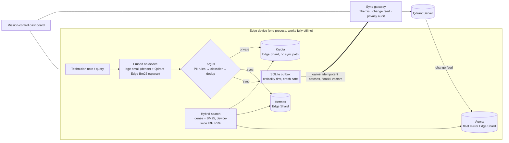

<h1> Smaran</h1>

[](https://github.com/SanTiwari07/Smaran/actions/workflows/ci.yml)

**Offline-first memory for fleets of edge devices: it keeps working without a network, keeps private notes on the device, and flags conflicting reports instead of silently dropping one.** Built on **Qdrant Edge** (on each device) and **Qdrant Server** (the fleet), for Code Cubicle 6.0, Problem Statement 3 (AI-Powered Edge Memory & Intelligence Platform).

[Scroll-through story](story/index.html) · [Benchmarks](docs/BENCHMARKS.md) · [Demo script](docs/DEMO.md) · [Implementation plan](docs/IMPLEMENTATION_PLAN.md) · [Audit and plan](docs/AUDIT_AND_PLAN.md)

> **Status: hackathon prototype.** Devices are local processes and "offline" is a software link switch. Results are measured on project-made data; see [Known limitations](#known-limitations).

## Contents

[The moment](#the-moment) · [Key features](#key-features) · [How it works](#how-it-works) · [Qdrant doing the work](#qdrant-doing-the-work) · [Tech stack](#tech-stack) · [The story](#the-story) · [Results](#results) · [PS3 checklist](#ps3-checklist) · [Getting started](#requirements) · [Configuration](#configuration) · [Running](#running) · [Verify it works](#verify-it-works) · [Using the prototype](#using-the-prototype) · [Demo](#demo) · [Project layout](#project-layout) · [Known limitations](#known-limitations) · [Roadmap](#roadmap) · [Team and license](#team-and-license) · [Credits](#credits)

## The moment

Two maintenance technicians report opposite things about machine CNC-07 while the factory Wi-Fi is down. When the devices reconnect, a timestamp-based sync (the pattern in Qdrant's Edge synchronization guide) keeps one report and silently drops the other. Smaran flags both, lets the shift supervisor decide, and keeps the history of what each device believed.

## Key features

- **Offline hybrid search.** Dense (bge-small) and BM25 search across three on-device Qdrant Edge shards, fused with RRF, with no network.
- **Private by construction.** PII rules force a note into Krypta, a shard with no sync code path; the gateway re-checks and a privacy audit reports the private records on the server (0 after the demo).
- **Explained placement.** Each note goes through PII rules, a classifier and dedup, and the reason is stored and shown as "Why here".
- **Crash-safe sync.** A SQLite outbox sends safety-critical notes first, resends are idempotent, and a hard kill loses nothing that was acknowledged.
- **Conflicts flagged, not guessed.** Version vectors separate *newer* from *concurrent*; concurrent reports are both marked contested until a supervisor resolves them, and history is kept.
- **Fleet knowledge on every device.** A mirror of Qdrant Server (Agora) is kept fresh through a change feed; low-confidence local queries can escalate to the server.
- **Mission-control dashboard.** Devices and sync, memory and search, conflicts and decisions, a live "Prove it" panel, and an auto-play demo (`?auto`).

## How it works

| Component | Role |
|---|---|
| **Krypta** | Keeps what's private. This Edge Shard has no sync code path, so its contents never leave the device. |
| **Hermes** | Carries everything else to the gateway when the link returns, through a crash-safe outbox that sends the most critical items first. |
| **Agora** | Shares what the fleet knows: a mirror of Qdrant Server on every device. |
| **Themis** | Decides what's true. Version vectors tell *newer* from *concurrent*, so conflicts are flagged, never guessed. |
| **Argus** | Decides where each note lives: PII rules first (no model can override them), then a learned classifier, then dedup against fleet knowledge. Every decision shows its reason. |



## Qdrant doing the work

| Step | Qdrant feature | Where |
|---|---|---|
| On-device store | `qdrant-edge-py` `EdgeShard.create/load`, three shards, named `dense` + sparse `bm25` vectors | `backend/device/store.py` |
| Keyword vectors | Qdrant Edge built-in `Bm25` (token ids match Qdrant Server's BM25) | `backend/device/embed.py` |
| Hybrid query | `QueryRequest` nearest-neighbour on each vector, fused with RRF across shards; device-wide IDF | `backend/device/search.py` |
| Filters | `Filter` / `FieldCondition` / `MatchValue` on keyword and integer payload indexes | `store.py` |
| Maintenance | `optimize()` on an idle timer (Edge has no background optimizer) | `backend/device/hermes.py` |
| Mutations | `UpdateOperation.upsert_points`, `set_payload` for status transitions | `store.py` |
| Edge → server | Outbox → gateway → `qdrant-client` upsert into a single-shard collection with payload indexes | `backend/gateway/server.py` |
| Server-side search | Prefetch dense + BM25 (IDF modifier), `FusionQuery(RRF)` for cloud escalation | `server.py` |

## Tech stack

| Technology | Purpose |
|---|---|
| Qdrant Edge (`qdrant-edge-py` 0.8.0) | On-device vector store: three shards, dense + BM25 vectors, hybrid queries |
| Qdrant Server v1.19.1 + `qdrant-client` 1.19.1 | Fleet collection, server-side hybrid search (Docker) |
| FastEmbed + bge-small-en-v1.5 | On-device dense embeddings (384-d) |
| scikit-learn | Residency / criticality classifier (logistic regression) |
| FastAPI + Uvicorn | Device and gateway HTTP APIs |
| SQLite | Durable outbox and Krypta journal |
| React 19, Vite, Tailwind CSS, TypeScript | Dashboard |
| pytest + Hypothesis | Tests, including property tests for Themis |
| GitHub Actions | CI: tests on Ubuntu and Windows, dashboard type-check and build |

Versions are pinned in [backend/requirements.txt](backend/requirements.txt) and [frontend/package.json](frontend/package.json).

## The story

`story/` is a scroll-driven walkthrough of the prototype and how it uses Qdrant: the problem, the three Edge shards, hybrid search, Argus, the Hermes outbox, Themis, the Qdrant Server path, and the measured proof, including what fell short. It has live demos of the Argus PII rules and the Themis version-vector comparison. It is plain HTML, CSS and JS with no build step.

- With the dashboard running (`npm --prefix frontend run dev`): http://localhost:5173/story/. The dashboard header has a **Back to story** button, and the story's **Open the prototype** buttons lead back to the dashboard.
- On its own: `python -m http.server 5180 --directory story`, then http://localhost:5180.
- `npm --prefix frontend run build` copies the story into `frontend/dist/story`, so one static host serves both.

The search results, outbox run and the classifier and dedup steps in the story are illustrative and labelled as such; only the PII rules are the real ones. Set `VITE_STORY_URL` to point the dashboard's button somewhere else.

## Results

All numbers are measured on the project's own data (synthetic or team-written; see [Known limitations](#known-limitations)). Methodology and raw output are in [docs/BENCHMARKS.md](docs/BENCHMARKS.md); regenerate with `python -m bench.bench`.

| Metric | Result |
|---|---|
| Offline hybrid search, 2,000 memories, 3 shards | **3.0 ms p50 / 4.0 ms p95** (target < 20 / 50 ms) |
| Retrieval quality, 40 golden queries | hybrid **hit@5 0.975**, hit@1 0.875 · dense-only hit@5 0.95 · BM25-only hit@5 0.95 |
| Conflict handling, 50 cases with clock skew | **Themis 50/50** vs naive last-writer-wins 13/50 |
| 5-device convergence, 1,000 random runs | **1000/1000** identical replicas, **0** concurrent edits lost |
| Residency classifier, 60 held-out hand-written notes | **98.3%** accuracy; safety-critical recall 0.9 |
| Personal data on Qdrant Server after the demo | **0** private records, **0** PII matches |
| Bandwidth vs syncing every note | **85.7% saved** (selection alone: 38.2%, which missed the 40% target; float16 vectors do the rest) |
| Crash between "gateway stored" and "device acked" | 3 of 3 ops resent, **0** duplicate memories, fleet mirror rebuilt |
| Demo rehearsals on the real Qdrant Server v1.19.1 | **10/10** (beats 1–4) · **10/10** (beat 5, the crash) |

## PS3 checklist

| PS3 goal | Where Smaran shows it |
|---|---|
| Searchable semantic memory on an edge device | Three Qdrant Edge shards per device (beat 1) |
| Low-latency vector **and hybrid** search without network | Dense + BM25 with RRF, device offline, ~3 ms (beat 1, latency benchmark) |
| Dynamically decide what stays local and what syncs | Argus, with a "Why here" reason on every memory (beat 2) |
| Intermittent connectivity, keep working offline | Link switch, SQLite outbox, crash recovery (beats 1, 3, 5) |
| Sync with **Qdrant Server** when connectivity returns | Gateway → Qdrant Server in Docker; points visible at `localhost:6333/dashboard` (beat 3) |
| Evolving memory, updates, conflicting information | Themis version vectors, supervisor resolution, Chronos history (beats 3, 4) |
| UI for memory, search results, sync status, activity | Mission-control dashboard: Devices and sync · Memory and search · Conflicts and decisions |
| A meaningful edge-to-cloud workflow, not just a local vector DB | Agora fleet mirror, change feed, cloud escalation, privacy audit on the server |

## Prove it in 60 seconds

```bash
.venv/Scripts/python -m pytest                                    # 45 tests: Themis properties, PII, sync, crash recovery, float16, retrieval
.venv/Scripts/python -m bench.bench conflicts convergence          # 50/50 vs 13/50; 1000/1000 converged
.venv/Scripts/python scripts/demo.py play b3                      # live conflict on the running stack, with checks
.venv/Scripts/python scripts/demo.py play b5                      # crash mid-sync, restart, 0 duplicates
```

`play` needs the stack running (`start-all`, below). The first two need nothing but the Python environment.

## Requirements

- Python 3.10+ (CI runs 3.13)
- Node.js 18+ (CI runs 22)
- Docker Desktop, for the real Qdrant Server (`qdrant/qdrant:v1.19.1`, matching the pinned `qdrant-client==1.19.1`). Without Docker, use embedded mode.

## Setup

One-time install. The commands use Windows paths; on macOS and Linux, replace `.venv/Scripts/python` with `.venv/bin/python`.

```bash
python -m venv .venv
.venv/Scripts/python -m pip install -r backend/requirements.txt
.venv/Scripts/python scripts/setup_models.py
npm --prefix frontend install
```

`setup_models.py` downloads about 65 MB of models once. After that, everything works offline.

Configuration is optional. Copy `.env.example` to `.env` to override defaults such as `QDRANT_URL`.

## Configuration

Optional. Copy `.env.example` to `.env`; every service reads it (`backend/common/config.py`). Do not commit `.env`.

| Variable | Default | Meaning |
|---|---|---|
| `QDRANT_MODE` | `server` | `server` uses Qdrant Server via Docker; `embedded` uses qdrant-client local mode (no Docker) |
| `QDRANT_URL`, `QDRANT_COLLECTION` | `http://127.0.0.1:6333`, `smaran` | Where the gateway stores the fleet collection |
| `GATEWAY_PORT`, `GATEWAY_URL` | `8000`, `http://127.0.0.1:8000` | Gateway address |
| `DEVICE_A_PORT`, `DEVICE_B_PORT` | `8001`, `8002` | Device processes |
| `DENSE_MODEL`, `DENSE_DIM`, `MODELS_DIR` | `BAAI/bge-small-en-v1.5`, `384`, `models` | On-device embedding model and where it is cached |
| `ESCALATE_AT` | `0.55` | Ask the server when the best local cosine is below this and the device is online |
| `DEDUP_AT` | `0.95` | Drop a note this similar to fleet knowledge in Agora |
| `SYNC_INTERVAL`, `SYNC_BATCH` | `2.0`, `20` | Outbox drain cadence (seconds) and batch size |
| `VECTOR_TRANSPORT` | `f16` | Dense vectors on the wire: `f16` (base64 float16) or `json` |
| `RUNTIME_DIR`, `LOG_DIR` | `runtime`, `logs` | Device state and service logs |

## Running

Start the whole stack:

```bash
.venv/Scripts/python scripts/demo.py start-all                     # Qdrant Server via Docker
.venv/Scripts/python scripts/demo.py start-all --qdrant embedded   # no Docker needed
```

Then open **http://localhost:5173**.

| Service | Address |
|---|---|
| Dashboard (mission control) | http://localhost:5173 |
| Story (scrollytelling) | http://localhost:5173/story/ |
| Gateway | http://127.0.0.1:8000 |
| Device A | http://127.0.0.1:8001 |
| Device B | http://127.0.0.1:8002 |
| Qdrant Server (Docker) | http://127.0.0.1:6333 (web UI at `/dashboard`) |

Each backend service serves interactive API docs at `/docs`, for example http://127.0.0.1:8001/docs.

## Verify it works

```bash
.venv/Scripts/python scripts/demo.py status        # prints /health for every service
curl http://127.0.0.1:8000/health                  # gateway; the JSON includes "server" (the Qdrant target)
curl http://127.0.0.1:6333/readyz                  # Qdrant Server (server mode only)
```

Then open http://localhost:5173: both device cards should read **Comms online**. `scripts/demo.py play b3` runs the conflict beat with pass/fail checks.

## Using the prototype

Write a note on device A while its link is cut, write the opposite on device B, restore both links, and watch the Conflicts view flag the pair:

```bash
curl -X POST http://127.0.0.1:8001/online -H "Content-Type: application/json" -d '{"online": false}'
curl -X POST http://127.0.0.1:8001/notes  -H "Content-Type: application/json" \
     -d '{"text": "CNC-07 running fine", "kind": "status", "machine": "CNC-07"}'
curl "http://127.0.0.1:8001/search?q=CNC-07%20status&limit=5"
curl -X POST http://127.0.0.1:8001/online -H "Content-Type: application/json" -d '{"online": true}'
```

Request bodies follow `NoteIn` in [backend/common/schema.py](backend/common/schema.py) (`text`, `kind`, `machine`, `author`). The same flow is scripted in [docs/DEMO.md](docs/DEMO.md).

Other commands:

```bash
.venv/Scripts/python scripts/demo.py status                 # health of every service
.venv/Scripts/python scripts/demo.py kill A                 # hard-kill device A (no clean shutdown)
.venv/Scripts/python scripts/demo.py start A                # start device A again
.venv/Scripts/python scripts/demo.py stop-all               # stop everything
.venv/Scripts/python scripts/demo.py wipe                   # delete runtime/ state (stop services first)
.venv/Scripts/python scripts/demo.py start-all --no-frontend
```

Service output goes to `logs/<service>.out`.

## Demo

```bash
.venv/Scripts/python scripts/demo.py reset b1        # known state for a beat: base, b1..b5
.venv/Scripts/python scripts/demo.py play b3         # run a beat and check it
.venv/Scripts/python scripts/demo.py rehearse --runs 10                        # beats 1-4
.venv/Scripts/python scripts/demo.py rehearse --runs 10 --beats b1 b2 b3 b4 b5 # with the crash beat
```

Every rehearsal is logged to `logs/rehearsal.log` with the Qdrant target and git commit. The presenter script is in [docs/DEMO.md](docs/DEMO.md).

## Development and testing

```bash
.venv/Scripts/python -m pytest                 # 45 tests, no model files or Docker needed
.venv/Scripts/python -m bench.bench            # benchmarks, written to docs/BENCHMARKS.md
.venv/Scripts/python -m ml.train               # retrain the classifier, written to ml/artifacts/
npm --prefix frontend run dev:mock             # dashboard on mock data, no backend needed
```

For logs and tracing, see [docs/DEBUGGING.md](docs/DEBUGGING.md).

## Troubleshooting

**`start-all` says "already started (runtime/pids.json exists)".** A previous run did not shut down cleanly. Run `stop-all`, then `start-all` again.

**Gateway fails to start with a Qdrant `timed out` error in `logs/gateway.out`.** The Qdrant container was still starting. Wait until `curl http://127.0.0.1:6333/readyz` says all shards are ready, then run `stop-all` and `start-all`. The gateway finishes any collection or index setup a timed-out start left behind.

**Upgrading from the old `qdrant/qdrant:v1.15.4` image.** The compose file now uses fresh volumes (`qdrant_storage`), because Qdrant can't skip minor versions when upgrading storage. The old `qdrant_data` volume held demo data only and can be removed with `docker volume rm infra_qdrant_data`.

**Docker is not available.** Use `start-all --qdrant embedded`.

## Project layout

| Folder | Contents |
|---|---|
| `backend/common/` | Shared by all services: `themis.py` (resolver), `pii.py`, `schema.py`, `vectors.py` (float16 transport), `config.py`, `log.py` |
| `backend/device/` | Edge device: shards, embeddings, Argus router and classifier, search, outbox and Krypta journal, Hermes sync |
| `backend/gateway/` | Sync gateway: idempotent ingest, Themis, change feed, audit |
| `backend/tests/` | pytest: Themis properties, PII, store, float16, retrieval, end-to-end PS3 story, crash recovery |
| `frontend/` | React dashboard (mission control): Devices and sync, Memory and search, Conflicts and decisions. `public/` holds the hero art and the logo |
| `story/` | The scroll-driven walkthrough (static site) |
| `ml/` | Labelled notes, training and evaluation for the residency classifier |
| `bench/` | Benchmarks, the 5-device simulation, the golden retrieval queries |
| `seed/` | Fleet seed data |
| `scripts/` | Model setup and the demo controller |
| `infra/` | Docker Compose for Qdrant Server |
| `docs/` | [Plan](docs/IMPLEMENTATION_PLAN.md), [Proposal](docs/PROPOSAL.md), [Demo](docs/DEMO.md), [Debugging](docs/DEBUGGING.md), [Benchmarks](docs/BENCHMARKS.md), [Audit and plan](docs/AUDIT_AND_PLAN.md) |

## Known limitations

- Label agreement (kappa) was measured against an AI second labeller, not a human: residency 1.000, criticality 0.661 (below our 0.7 target; disagreements are all one level apart). A human second labeller has not yet labelled `ml/data/handwritten_notes.csv`. See [BENCHMARKS](docs/BENCHMARKS.md).
- The classifier test set is small (60 notes), and the rule combining model and keyword criticality was chosen after seeing those results.
- The 40 golden retrieval queries were written and labelled by the team against a known corpus; treat those numbers as indicative.
- Convergence is measured for 5 simulated devices; larger fleets are a design claim, not a measurement.
- No device signing, authentication or TLS yet: services bind to 127.0.0.1. Planned: Ed25519 device keys, mTLS, OIDC for supervisors.
- The story and dashboard load Mona Sans and Geist Mono from Google Fonts; offline they fall back to system fonts, so the look differs slightly.
- Mirror refresh uses the gateway's change feed, not Qdrant partial snapshots.
- Qdrant Edge keeps recent writes in memory until a flush (1–2 s on the dev laptop), so SQLite is the durable log: the outbox and a local Krypta journal are replayed on start, and Agora is re-pulled after an unclean shutdown.
- Each Edge shard pre-allocates tens of MB on disk for its write-ahead log and segments.

## Roadmap

Done: three-shard offline hybrid search, Argus, outbox and crash recovery, Themis, change feed, Qdrant Server mode, float16 transport, retrieval evaluation, kill-and-replay beat, dashboard with "Prove it", auto-play demo, CI.

Not done (from [docs/AUDIT_AND_PLAN.md](docs/AUDIT_AND_PLAN.md)):

- [ ] A human second labeller for the classifier test set, and a tighter criticality 1-vs-2 definition
- [ ] Recency-aware ranking (needs a golden set with a time dimension to show it helps)
- [ ] Second physical device on a real network
- [ ] Device signing, authentication and TLS
- [ ] Fine-tuned Laya classifier (logistic regression is what ships)
- [ ] Docker Compose for the devices and gateway (only Qdrant Server runs in Docker)

Partial-snapshot refresh of Agora was built and measured but saved no bandwidth at this size, so the change feed is used ([BENCHMARKS](docs/BENCHMARKS.md)).

## Team and license

- **Team:** not listed yet. *TODO: add members and roles before submission.*
- **License:** none yet; the repository has no `LICENSE` file. *TODO: choose one before the repository is shared publicly.*
- **Demo video and screenshots:** not yet added. *TODO: record the demo ([docs/DEMO.md](docs/DEMO.md)) and add a dashboard screenshot near the top.*

## Credits

Built by the team on these open-source projects and models (hackathon rules require crediting third-party work):

| Project | Licence | Used for |
|---|---|---|
| [Qdrant Edge](https://qdrant.tech/documentation/edge/) (`qdrant-edge-py`) | Apache-2.0 | On-device vector search, Edge Shards, built-in BM25 |
| [Qdrant](https://github.com/qdrant/qdrant) server and [`qdrant-client`](https://github.com/qdrant/qdrant-client) | Apache-2.0 | Fleet collection, server-side hybrid search |
| [FastEmbed](https://github.com/qdrant/fastembed) | Apache-2.0 | On-device ONNX embeddings |
| [BAAI/bge-small-en-v1.5](https://huggingface.co/BAAI/bge-small-en-v1.5) (Qdrant's quantized ONNX export) | MIT | Dense 384-d embeddings |
| [ONNX Runtime](https://github.com/microsoft/onnxruntime) | MIT | Model inference (via FastEmbed) |
| [scikit-learn](https://scikit-learn.org/) | BSD-3-Clause | Residency / criticality classifier |
| [NumPy](https://numpy.org/) | BSD-3-Clause | float16 vector transport |
| [FastAPI](https://fastapi.tiangolo.com/), [Pydantic](https://docs.pydantic.dev/) | MIT | Device and gateway APIs |
| [Uvicorn](https://www.uvicorn.org/), [HTTPX](https://www.python-httpx.org/), [python-dotenv](https://github.com/theskumar/python-dotenv) | BSD-3-Clause | Serving, HTTP client, configuration |
| [pytest](https://pytest.org/) | MIT | Tests |
| [Hypothesis](https://hypothesis.works/) | MPL-2.0 | Property tests for Themis |
| [React](https://react.dev/), [Vite](https://vite.dev/), [Tailwind CSS](https://tailwindcss.com/) | MIT | Dashboard |
| [Mona Sans](https://github.com/github/mona-sans), [Geist Mono](https://github.com/vercel/geist-font) (via Google Fonts) | SIL OFL 1.1 | Dashboard and story typography |
| [TypeScript](https://www.typescriptlang.org/) | Apache-2.0 | Dashboard |

Design and artwork: the dashboard and story follow the look of qdrant.tech (colours, type, layout patterns), and the Mars-and-astronauts hero art (`story/assets/hero.webp`, `frontend/public/hero.webp`) is cropped from Qdrant's website. It is Qdrant's work, used here for the hackathon demo; this is an independent project, not affiliated with Qdrant, and the art should be replaced before any public deployment. The logo (a summation sign drawn in dots) is ours.

Design references: Qdrant's [Edge synchronization guide](https://qdrant.tech/documentation/edge/edge-synchronization-guide/) (the mutable + mirror shard pattern we extend) and DeCandia et al., *Dynamo* (SOSP 2007), for version vectors. The maintenance notes and manuals in `ml/data/` and `seed/` were written by the team (the training templates are generated by `ml/data/gen_notes.py`); names and phone numbers in them are synthetic.
