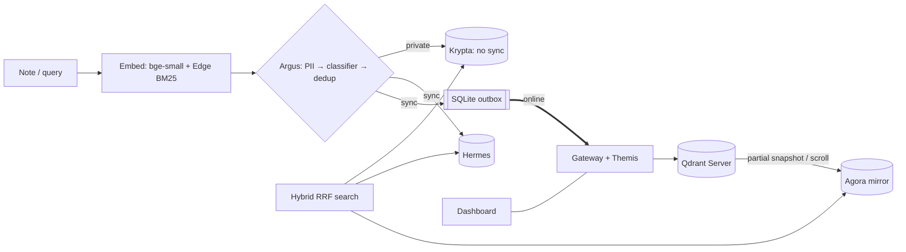

# 00 — MASTER RESEARCH INDEX: Code Cubicle 6.0 · Problem Statement 3

Research date **26 Sep 2026** · Project: **Smaran** (repo `SanTiwari07/Smaran`) · Labels: **FACT** · **SOURCE-REPORTED CLAIM** · **ANALYST INFERENCE** · **RECOMMENDATION** · **NOT FOUND — REQUIRES VERIFICATION**

---

## Executive summary

- **The hackathon:** Code Cubicle 6.0 by **Geek Room** on HackCulture. It is hybrid: an online elimination round (submission **21–30 Sep 2026**), then **~15–20 teams** go to an **offline final on 11 Oct 2026 at Paytm, Noida**. **Selection for the final is based on team members' GitHub and LinkedIn profiles** (FACT).
- **PS3 is Qdrant's problem statement** (the Qdrant logo is on the official PDF). It requires an offline-first app **powered by Qdrant Edge** that syncs with **Qdrant Server**, decides what stays local, handles conflicts, and demonstrates "a meaningful edge-to-cloud AI workflow, rather than simply running a local vector database" (FACT).
- **What Qdrant values:** in its own hackathons, Qdrant judges on **Creativity, Technical Depth and Qdrant Usage**, bans "RAG or simple chatbots", and rewards "retrieval as an engineering primitive". A 2025 runner-up was a **robot memory with safety labels**. It has already published polished Edge demos of "a device that remembers offline" (FACT).
- **The white space:** Qdrant's reference sync pattern syncs everything, uses an in-memory queue, and dedups by wall-clock timestamp. Rival PS3 teams mostly use timestamp conflict rules and static "what syncs" rules. The strongest rival (**AegisEdge**) is excellent, but **depends on `qdrant-client`, not Qdrant Edge**, and admits its **Qdrant Server round trip is untested** (FACT from their repo; the implication is ANALYST INFERENCE).
- **Recommendation:** **Don't pivot.** Smaran (private / mutable / mirror Edge Shards, a measured residency classifier, version-vector conflicts, a crash-safe outbox, a 3-view dashboard) sits squarely in that white space. **Close four gaps before 30 Sep:**
  1. Run against the real **Qdrant Server**.
  2. Make the **GitHub README + CI + LinkedIn** sell it.
  3. Fix the **bandwidth** miss (float16 vectors).
  4. Add a **retrieval-quality** eval.

  For the 11 Oct final, add **partial-snapshot** mirror sync and a live **kill-and-replay** beat.

## Quick navigation

| # | File | What it answers |
|---|---|---|
| 01 | [Hackathon overview](01_HACKATHON_OVERVIEW.md) | Dates, rules, prizes, partners, eligibility, date conflicts, hidden requirements |
| 02 | [PS3 analysis](02_PROBLEM_STATEMENT_3_ANALYSIS.md) | Verbatim PS3; requirement matrix R1–R10 vs Smaran; users, pains, constraints, metrics |
| 03 | [Organizer research](03_ORGANIZER_RESEARCH.md) | Geek Room and HackCulture; past editions, formats, winners |
| 04 | [PS3 organization: Qdrant](04_PS3_ORGANIZATION_RESEARCH.md) | Company, Edge capabilities and limits, official sync pattern, strategy, how Qdrant judges |
| 05 | [Sponsors and partners](05_SPONSOR_AND_PARTNER_RESEARCH.md) | Pathway, n8n, Cloudinary, Omnidimension, Logitech, Wayzyy, Eventopia, Paytm; use or avoid |
| 06 | [Competitor analysis](06_COMPETITOR_ANALYSIS.md) | Rival PS3 repos, Qdrant's reference demos, market products; patterns |
| 07 | [Previous winners](07_PREVIOUS_WINNERS_ANALYSIS.md) | CC3 winners; Qdrant 2025/2026/Sketch & Search winners |
| 08 | [Winning patterns](08_WINNING_PATTERNS.md) | 12 patterns + a Smaran checklist |
| 09 | [Differentiation strategy](09_DIFFERENTIATION_STRATEGY.md) | "Why remember us?"; axes; positioning statement |
| 10 | [WOW features](10_WOW_FEATURES.md) | 11 candidates classified MUST / HIGH / NICE / AVOID |
| 11 | [What NOT to build](11_WHAT_NOT_TO_BUILD.md) | Overused ideas, risky features, claims to avoid |
| 12 | [Technical architecture](12_TECHNICAL_ARCHITECTURE.md) | Target diagram, components, data model, Qdrant-usage map, sequences, security |
| 13 | [Tech stack](13_TECH_STACK_RECOMMENDATION.md) | Layer-by-layer choices, alternatives, trade-offs |
| 14 | [MVP roadmap](14_MVP_ROADMAP.md) | Phases 1–4 with owners and a day-by-day plan to the freeze |
| 15 | [Judging strategy](15_JUDGING_STRATEGY.md) | Official criteria, working rubric, evidence map |
| 16 | [Demo strategy](16_DEMO_STRATEGY.md) | 5-minute flow, live vs preloaded, checklist, failure playbook |
| 17 | [Pitch strategy](17_PITCH_AND_PRESENTATION_STRATEGY.md) | 10-slide deck, roles, language rules |
| 18 | [Judge perspective](18_JUDGE_PERSPECTIVE.md) | 10 s / 30 s / 2 min / after; 15 likely questions with answers |
| 19 | [Risk analysis](19_RISK_ANALYSIS.md) | 20 risks with P / I / mitigation / backup |
| **20** | **[FINAL PROJECT STRATEGY](20_FINAL_PROJECT_STRATEGY.md)** | **The 17 answers + action checklist** |
| 21 | [Source database](21_SOURCE_DATABASE.md) | Every source, reliability, source conflicts, method notes |

## Hackathon summary ([01](01_HACKATHON_OVERVIEW.md))

| Item | Value |
|---|---|
| Organizer | Geek Room (co-founders Manas Chopra, Arnav Gupta, Pratham Batra); platform HackCulture |
| Dates | Registration closed 20 Sep · **Submission 21–30 Sep** · **Final 11 Oct, 09:00–18:00, Paytm Noida** |
| ⚠ Conflict | The PDF footer says "3 OCT ONLINE · 11 OCT OFFLINE" → **freeze on 30 Sep; confirm by email** |
| Team | 1–4 · 3,700 registrations |
| Prizes relevant to PS3 | General 1st/2nd/3rd: ₹12,000 / ₹10,000 / ₹8,000 (+ a villa stay in Goa for the winner, source-reported). The Cloudinary ₹1.2L/₹40K prizes are for PS2 only |
| Final criteria | Not published. The Devpost fragment reads "Innovation & Creativity; Technical Implementation…" |

## PS3 summary ([02](02_PROBLEM_STATEMENT_3_ANALYSIS.md))

Eight goals: on-device semantic memory · offline low-latency **vector + hybrid** search · **dynamic** local-vs-sync decisions · intermittent connectivity · **sync with Qdrant Server** · evolving memory and **conflicts** · a UI for memory / search / sync / activity · a meaningful edge-to-cloud workflow (**not just a local vector DB**). Smaran covers all of them; the one open item is **R6 (the real Qdrant Server run)**.

## Organizer ([03](03_ORGANIZER_RESEARCH.md))

A student-founded (2023, MSIT) community that has grown into corporate-hosted hackathons (Microsoft, Mastercard, Paytm). CC5 format: a 5-minute online pitch + 2-minute Q&A; the top 15 do an **8-hour on-site build**. CC3 winners paired AI with concrete human problems and trust themes.

## PS3 organization: Qdrant ([04](04_PS3_ORGANIZATION_RESEARCH.md))

Berlin-based; a $50M Series B (Mar 2026, AVP lead); strategy "composable vector search … from the data center to the device". **Edge:** in-process, beta, manual `optimize()`, restore-only snapshots, built-in BM25, two-shard sync with partial snapshots.

## Sponsors ([05](05_SPONSOR_AND_PARTNER_RESEARCH.md))

Only Qdrant is essential. Pathway, n8n, Cloudinary and Omnidimension add no genuine advantage for offline-first PS3. **Do not integrate them now.**

## Competitors ([06](06_COMPETITOR_ANALYSIS.md))

Rivals: **AegisEdge** (strong; SIGKILL demo, CI, signing; uses `qdrant-client`; server untested), **FieldEdge** (Android + Qdrant Edge; timestamp conflicts), **EdgeSync AI** (generic), **Edge-Mind-AI** (unknown). Market: Couchbase Lite, ObjectBox, Ditto, PowerSync, sqlite-vec, LanceDB, Mem0. Realm Sync is EOL; Google's edge RAG SDK is deprecated.

## Winning patterns ([07](07_PREVIOUS_WINNERS_ANALYSIS.md), [08](08_WINNING_PATTERNS.md))

One user and one stake; sponsor primitives visibly doing the work; LLM minimised; one unforgettable moment; falsifiable, measured claims; honest limits; the README as the pitch; narrow and deep.

## Differentiation ([09](09_DIFFERENTIATION_STRATEGY.md))

> Everyone else shows that a device can remember. **Smaran shows the memory stays correct and private when devices go offline and disagree.** It runs on real Qdrant Edge, syncs to a real Qdrant Server, and every claim is measured.

## Recommended solution direction ([20](20_FINAL_PROJECT_STRATEGY.md))

Keep Smaran: a maintenance copilot use case, 3 Edge Shards, the Argus router, Themis version vectors, a crash-safe outbox, a gateway, Qdrant Server, the Olympus dashboard.

## Architecture ([12](12_TECHNICAL_ARCHITECTURE.md))

## MVP ([14](14_MVP_ROADMAP.md))

Built: everything in the core. **Before 30 Sep:** a Qdrant Server run (10/10), the backup video, README hero GIF + CI + credits, float16 transport, the retrieval eval, kappa. **For 11 Oct:** partial snapshots, kill-and-replay, auto demo mode, on-site-build readiness.

## WOW features ([10](10_WOW_FEATURES.md))

MUST: **the conflict reveal** (built) and a **live Qdrant Server proof**. HIGH: pull-the-plug durability, the partial-snapshot mirror, Chronos, "Why here?" badges, the retrieval scoreboard. AVOID: a local LLM chat, a P2P mesh.

## Risks ([19](19_RISK_ANALYSIS.md))

Top five: Qdrant Server not exercised · elimination on profile · Docker at the venue · 30 Sep vs 3 Oct ambiguity · a strong rival on durability/security.

## Demo ([16](16_DEMO_STRATEGY.md)) and pitch ([17](17_PITCH_AND_PRESENTATION_STRATEGY.md))

5:00 total: problem (20 s) → failing defaults (20 s) → solution (25 s) → **4 live beats (2:30)** → Qdrant usage (30 s) → measured impact (25 s) → future (20 s) → close.
Close line: **"Qdrant Edge gave devices a memory. Smaran makes that memory trustworthy offline."**

## Open verification items

1. The HackCulture submission-form fields and the meaning of "3 OCT ONLINE" → email team.geekroom@gmail.com
2. The final-round judging criteria and the judges
3. Code Cubicle 4.0 / 5.0 winners (LinkedIn search)
4. The latest `qdrant-edge-py` release and any breaking changes (check after the freeze)
5. The Qdrant CTO's name (not re-verified this session)
