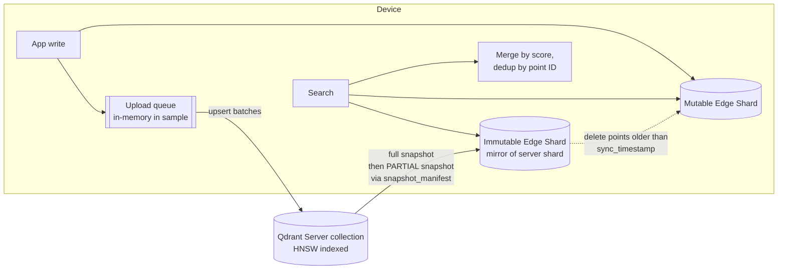

# 04 — PS3 Organization Research: Qdrant

← [03 Organizer](03_ORGANIZER_RESEARCH.md) · [Master index](00_MASTER_RESEARCH_INDEX.md) · Next: [05 Sponsors](05_SPONSOR_AND_PARTNER_RESEARCH.md)

## 0. Who owns PS3?

**FACT:** The officially hosted PS3 PDF carries the **Qdrant logo** beside "PROBLEM STATEMENT 03". The event page lists **Qdrant** as "Technology Partner" [S1][S2]. PS3 requires "Qdrant Edge" and "Qdrant Server" by name.

**ANALYST INFERENCE:** Qdrant wrote or approved PS3, and a Qdrant person (DevRel or a solutions engineer) is likely to review PS3 finalists. Speak Qdrant's vocabulary accurately: Edge Shard, mutable/immutable shards, partial snapshots, `optimize()`, hybrid prefetch, RRF, payload indexes, "vector search engine, not a database".

## 1. Organization profile

| Field | Value | Label | Source |
|---|---|---|---|
| Legal/brand name | Qdrant (Qdrant Solutions GmbH, per the "Impressum"; name not independently verified) | FACT (brand) / NOT VERIFIED (entity) | [Q1] |
| Website | https://qdrant.tech | FACT | |
| HQ | Berlin, Germany (and New York per press datelines) | SOURCE-REPORTED | [Q2][P1] |
| Founded | 2021, "from a 2021 GitHub side project" | FACT (CEO keynote recap) | [Q5] |
| CEO / co-founder | **André Zayarni** | FACT | [Q5] |
| CTO / co-founder | Andrey Vasnetsov (widely reported; **not re-verified in this session**) | NOT VERIFIED | — |
| COO | Manuel Meyer | FACT | [Q5] |
| Head of DevRel | Neil Kanungo. His GitHub account `kanungle` hosts the 2025 hackathon winner mirrors, which suggests DevRel runs Qdrant's hackathons | FACT (role) / ANALYST (hackathon link) | [Q5][Q7] |
| Industry | Vector search infrastructure for AI (RAG, agents, recommendations, multimodal search, edge) | FACT | [Q2] |
| Funding | **$50M Series B, 12 Mar 2026, led by AVP**, with Bosch Ventures, Unusual Ventures, Spark Capital, 42CAP | FACT | [Q2][P1] |
| Scale | "250 million downloads", "29,000 GitHub stars" (Mar 2026) | FACT (self-reported) | [Q2] |
| Named customers | Canva, Bazaarvoice, HubSpot (20B+ vectors, 150 clusters), Roche, Bosch, OpenTable, Tripadvisor, Bayer, J&J | FACT (self-reported) | [Q2][Q5] |
| Business model | Open-source engine (Apache-2.0) + Qdrant Cloud (managed), Hybrid Cloud, Enterprise, Cloud Inference; Edge in beta; Serverless "coming soon" | FACT | [Q3] |

## 2. Product and technical ecosystem

| Product | What it is | Relevance to PS3 |
|---|---|---|
| Qdrant (server) | Rust vector search engine; REST + gRPC; filterable HNSW; hybrid (dense + sparse) with prefetch + fusion; multivector; quantization; payload indexes | The **"Qdrant Server"** PS3 wants devices to sync with |
| Qdrant Cloud / Hybrid Cloud | Managed clusters | Optional "centralized cloud knowledge" |
| **Qdrant Edge (beta)** | **Embedded, in-process** library: "Think of it as SQLite, but for vector search". Python (`qdrant-edge-py`) and Rust (`qdrant-edge`) crates. ~11 MB install footprint | The **mandatory** PS3 technology |
| FastEmbed | ONNX-based local embedding library (dense, sparse, SPLADE, miniCOIL, ColBERT, rerankers) | The documented way to embed on-device [Edge docs: "On-Device Embeddings"] |
| Built-in BM25 embedder in Edge | `Bm25` / `Bm25Config`; **same token IDs and scoring as server-side BM25**, so a shard restored from a server snapshot can be queried with local BM25 vectors | Hybrid search without network |
| Qdrant MCP server, Agent Skills (skills.qdrant.tech) | Agent tooling | Low relevance |

### 2.1 Qdrant Edge: exact capabilities and limits (FACT [Q-doc-vs])

| Capability | Edge | Server |
|---|---|---|
| Architecture | In-process library | Client-server |
| Connectivity | Works fully offline | Needs network |
| Collections | **None**; one Edge Shard per dataset | Named collections |
| Multitenancy | Payload partitioning in one shard, or one shard per tenant/device | Payload, user-defined sharding, tiered |
| Optimization | **Manual `optimize()`, synchronous** | Background optimizer |
| HNSW | Manual for large shards; **new points are brute-force searchable until optimized** | Automatic |
| Snapshots | **Restore only** | Create + restore |
| Dense / sparse / multivector / named vectors / hybrid / quantization | Supported | Supported |
| Query scoring | NN, recommend, discovery, context, **formula**, **MMR**, order-by, sample | same |
| `query_groups`, `search_matrix` | **Rust only** | Available |

### 2.2 Qdrant's official sync architecture (FACT [Q-doc-sync][Q-doc-guide])

Documented purposes of syncing: offload indexing, backup/restore, data aggregation from many devices, and sync between devices [Q-doc-guide].

Key API calls: `EdgeShard.create/load`, `update(UpdateOperation.upsert_points)`, `query(QueryRequest(...))`, `optimize()`, `snapshot_manifest()`, `EdgeShard.unpack_snapshot()`, `update_from_snapshot()`, and the server endpoint `POST /collections/{c}/shards/{id}/snapshot/partial/create` with the manifest.

**Gaps the reference leaves open** (ANALYST INFERENCE, verified by reading the docs): governance (everything is dual-written), durability ("This is in-memory queue / For production use cases consider persisting changes"), conflict semantics (a wall-clock `timestamp` payload plus point-ID dedup), and maintenance scheduling.

## 3. Qdrant's public Edge demos and tutorials (the bar PS3 judges have in their heads)

| Artifact | What it shows | URL |
|---|---|---|
| **Smart Glasses × Qdrant Edge** (qdrant/qdrant-edge-demo, 63★, updated 24 Sep 2026) | CLIP frames → mutable shard + **SQLite-backed persistent queue** → server HNSW → snapshot sync to immutable shard → MMR query over both | https://github.com/qdrant/qdrant-edge-demo |
| **Edge Mission Control**, robot object memory (qdrant-labs, Jun–Jul 2026) | YOLOE + SigLIP2 + Florence-2; dense + BM25 + RRF in < 1 ms; live facets; "teach a concept" in ~300 ms; live-demo site; `?auto` self-playing mode; `make test` headless verification | https://github.com/qdrant-labs/edge-mission-control · https://qdrant-edge-mission-control.vercel.app/ |
| **Video anomaly detection, edge to cloud** (with Twelve Labs, NVIDIA, Vultr) | Jetson two-shard design; kNN-distance anomaly; ~6× less cloud processing, ~95% of anomalies caught | https://qdrant.tech/blog/video-anomaly-detection-edge-to-cloud/ |
| Tavus case study | Per-conversation edge collections; retrieval ~20–25 ms; "architecture beats micro-optimizations" | https://qdrant.tech/blog/case-study-tavus/ |
| Community ports | React Native (rust-dd), Flutter, Raspberry Pi armv7l, AR glasses on Snapdragon | GitHub search "qdrant-edge" |

**ANALYST INFERENCE:** Qdrant's own demos already cover **"a device that remembers and searches offline"**: object memory, visual memory, sub-ms search. A PS3 entry that only reproduces this adds nothing to what Qdrant already knows. The white space is what the reference pattern leaves open: **governance, conflict semantics, durability and fleet coherence**. That is Smaran's lane.

## 4. Strategic priorities (what Qdrant cares about now)

| Priority | Evidence | Label |
|---|---|---|
| **"Composable vector search"**: dense, sparse, filters, multivector and custom scoring as query-time primitives | Series B post title and thesis [Q2]; "three C's: composability, controllability, configurability" [Q5] | FACT |
| **Edge and robotics as a strategic third wave** ("RAG 1.0 → Agentic AI → Embedded AI") | Edge launch post [Q4]; Vector Space Day 2026 had an "Edge and Robotics" track [Q5]; Series B: "One retrieval architecture from the data center to the device" [Q2] | FACT |
| Agents need retrieval in a tight loop | Series B [Q2] | FACT |
| **"Beyond chatbots"** | Their 2026 hackathon banned "RAG or simple chatbots" [Q6]; the 2025 recap is titled "Thinking Outside the Bot" [Q7] | FACT |
| **Retrieval evaluation**: "similarity and relevance are not the same thing"; measure hit rate, precision, recall | Arize talk spotlighted in Qdrant's recap [Q5] | FACT (that Qdrant spotlighted it) |
| Engineering rigour: Rust, "we do it the hard way", "not a vector database, a vector search engine" | CEO/COO keynotes [Q5] | FACT |
| Partners: Twelve Labs, NVIDIA, Vultr, Neo4j, Mistral, CrewAI, Superlinked | Blogs and hackathon prizes [Q6][Q7] | FACT |

## 5. How Qdrant judges hackathons (strongest evidence of their taste)

| Hackathon | Criteria (FACT) | Winners' pattern (ANALYST) |
|---|---|---|
| Vector Space Hackathon 2025 (winners 26 Sep 2025, Berlin) | **Creativity, Technical Depth, Qdrant Usage** [Q7] | 1st: 3D product-terrain explorer; **2nd: RoboBank, robot trajectory memory with safety labels and reflex retrieval**; 3rd: spatio-temporal NPC memory running locally on ~3 GB VRAM |
| "Think Outside the Bot" 2026 (winners at Vector Space Day 2026) | **Innovation, Creativity, Technical Depth**; no RAG, no simple chatbots [Q6] | 1st MemoryAtlas: **six named vectors per point**, Recommend API with negatives + datetime filters. Honourable mention Cardinal: "LLM touched only twice … everything in between is Qdrant doing the work" |
| Sketch & Search (with Google DeepMind + Freepik, Nov 2025) | Creative quality, **effective search and similarity**, UX trade-offs, **guardrails**, real-world applicability [Q8] | "treat retrieval as an engineering primitive — not a bolt-on feature" |

**Takeaways for Smaran (RECOMMENDATION):**

1. **Show Qdrant doing the work.** Name the Edge features used: named dense + sparse vectors, built-in BM25, payload indexes and filters, RRF, `optimize()` scheduling, facets. Ideally add partial snapshots and formula/MMR scoring.
2. **Memory and safety for machines is a winning motif** (RoboBank, 2nd place). Smaran's safety-critical-first outbox and conflict flags fit it.
3. **Don't lead with an LLM.** Smaran's decision to cut the local LLM chat is consistent with Qdrant's taste.
4. **Bring retrieval-quality numbers**, not only latency.

## 6. Customer pain points and operational challenges Qdrant has publicly named (FACT [Q3][Q4][Q-blog-memory])

Latency, connectivity, cost, privacy and isolation at the edge; brute-force search until `optimize()`; indexing cost on devices (hence offloading to the server); keeping many devices consistent; multitenancy per device.

## 7. Regulatory context (ANALYST INFERENCE)

Qdrant emphasises data privacy and sovereignty in its Hybrid Cloud partnerships (STACKIT, OVHcloud, Aleph Alpha posts in llms.txt). On-device privacy is part of the Edge pitch [Q-blog-memory]. In India, the DPDP Act 2023 makes on-device minimisation a credible business argument.

## 8. Open questions (NOT FOUND — REQUIRES VERIFICATION)

- Which Qdrant person, if any, judges the CC 6.0 final.
- Whether Qdrant offers any post-hackathon perk (credits, a blog feature). None is listed.
- The exact `qdrant-edge-py` version they expect. The latest was not checked; Smaran pins 0.8.0.

## Sources

| ID | Source | URL | Accessed | Info | Reliability |
|---|---|---|---|---|---|
| Q1 | Qdrant Edge docs overview | https://qdrant.tech/documentation/edge/ | 2026-09-26 | Beta, SQLite analogy, sync purposes | HIGH |
| Q-doc-vs | Edge vs Qdrant Cluster | https://qdrant.tech/documentation/edge/edge-vs-qdrant-cluster/ | 2026-09-26 | Capability table | HIGH |
| Q-doc-sync | Data Synchronization Patterns | https://qdrant.tech/documentation/edge/edge-data-synchronization-patterns/ | 2026-09-26 | Snapshot, partial snapshot, dual-write | HIGH |
| Q-doc-guide | Synchronize with a Server | https://qdrant.tech/documentation/edge/edge-synchronization-guide/ | 2026-09-26 | Two-shard pattern | HIGH |
| Q-doc-bm25 | BM25 with Qdrant Edge | https://qdrant.tech/documentation/edge/edge-bm25/ | 2026-09-26 | Built-in BM25, server compatibility | HIGH |
| Q2 | Series B announcement | https://qdrant.tech/blog/series-b-announcement/ | 2026-09-26 | Funding, investors, customers, strategy | HIGH |
| P1 | Business Wire / FinSMEs / AVP (search snippets) | https://www.businesswire.com (Qdrant Series B, 12 Mar 2026); https://www.finsmes.com | 2026-09-26 | Cross-check of the $50M, Berlin | MEDIUM |
| Q3 | Qdrant Edge product page | https://qdrant.tech/edge/ | 2026-09-26 | Use cases, product lineup | HIGH |
| Q4 | "Qdrant Edge (Private Beta)" blog | https://qdrant.tech/blog/qdrant-edge/ | 2026-09-26 | Three waves; design targets | HIGH |
| Q-blog-memory | "Memory at the Edge" blog | https://qdrant.tech/blog/qdrant-edge-on-device-vector-search/ | 2026-09-26 | Demo internals, footprint | HIGH |
| Q5 | Vector Space Day SF 2026 recap | https://qdrant.tech/blog/vector-space-day-2026-recap/ | 2026-09-26 | Leadership, thesis, retrieval-eval talk | HIGH |
| Q6 | Vector Space Hackathon 2026 winners | https://qdrant.tech/blog/vector-space-hackathon-winners-2026/ | 2026-09-26 | Criteria, winners | HIGH |
| Q7 | 2025 hackathon winners | https://qdrant.tech/blog/vector-space-hackathon-winners-2025/ | 2026-09-26 | Criteria incl. "Qdrant Usage"; RoboBank | HIGH |
| Q8 | Sketch & Search winners | https://qdrant.tech/blog/sketch-n-search-winners/ | 2026-09-26 | Criteria; "retrieval as an engineering primitive" | HIGH |
| GH-demos | GitHub READMEs: qdrant/qdrant-edge-demo, qdrant-labs/edge-mission-control | URLs above | 2026-09-26 | Reference implementations | HIGH |
| Tavus | Tavus case study | https://qdrant.tech/blog/case-study-tavus/ | 2026-09-26 | Edge retrieval latency | HIGH |
