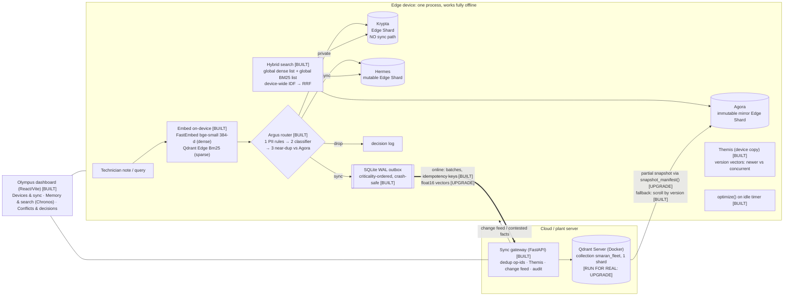
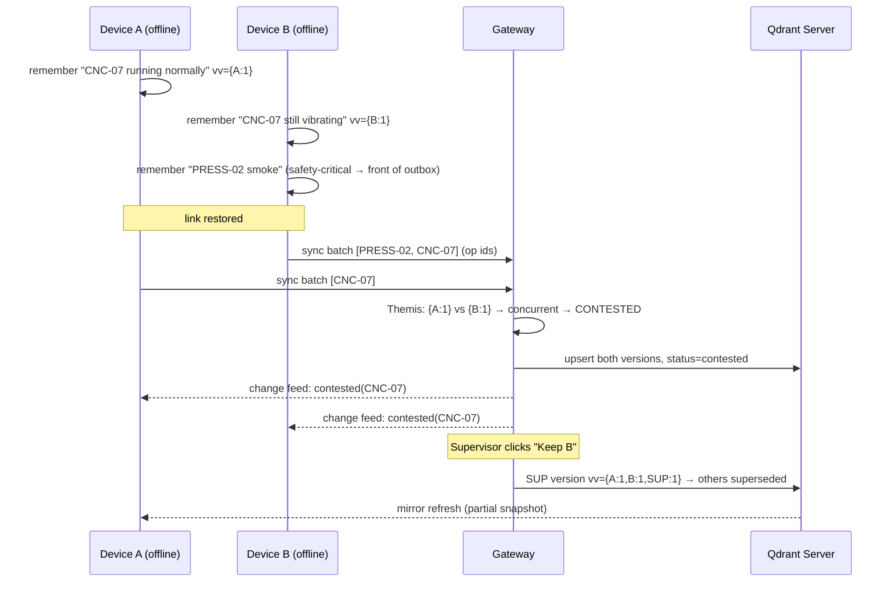

# 12 — Technical Architecture

← [11 What not to build](11_WHAT_NOT_TO_BUILD.md) · [Master index](00_MASTER_RESEARCH_INDEX.md) · Next: [13 Tech stack](13_TECH_STACK_RECOMMENDATION.md)

**RECOMMENDATION:** Keep Smaran's current architecture (see `docs/PROPOSAL.md` §5 and `docs/IMPLEMENTATION_PLAN.md`). Make three research-driven upgrades: (1) a real Qdrant Server, (2) partial-snapshot mirror refresh, (3) compact vector transport. This file documents the target architecture and marks each part **[BUILT]**, **[UPGRADE]** or **[FUTURE]**.

## 1. System diagram (target for the 11 Oct final)

## 2. Components

| Layer | Component | Responsibility | Status |
|---|---|---|---|
| Frontend | **Olympus** (React + Vite + TS) | 3 views: devices/sync/audit; memory/search + Chronos; conflicts/decisions. Mock mode for UI dev | BUILT |
| Device API | FastAPI, one process per simulated device (ports 8001/8002) | `/remember`, `/search`, `/link` (online flag), `/outbox`, `/memories` | BUILT |
| Device storage | **Qdrant Edge** (`qdrant-edge-py` 0.8.0): 3 Edge Shards | Named vectors `dense` (cosine, 384) + `bm25` (sparse, IDF computed device-wide) + payload | BUILT |
| Device durability | SQLite (WAL) outbox + decision log | Crash-safe queue, replay on start | BUILT |
| AI: embeddings | FastEmbed `bge-small-en-v1.5`; Edge built-in `Bm25` | Dense + sparse, fully offline after setup | BUILT |
| AI: residency | LogReg on embeddings + PII rules + safety keywords | private / sync / drop + criticality with reason | BUILT (98.3% held-out) |
| Consistency | **Themis** (pure Python, shared by device and gateway) | Version-vector comparison; supersede vs contest; order-independent `resolve(set)` | BUILT (property tests) |
| Gateway | FastAPI (port 8000) | Idempotent `/sync`, resolve, change feed, supervisor `/resolve`, privacy audit | BUILT |
| Cloud DB | **Qdrant Server** `qdrant/qdrant` in Docker (6333) | Fleet collection; source of partial snapshots | **Code done; run it** |
| Monitoring | Structured JSON logs `logs/<service>.out`; activity feed in the UI; `demo.py status` | Traceability | BUILT |
| Security | PII rules; structural private shard; idempotency keys; local-only binds (127.0.0.1) | Privacy and replay safety | BUILT; auth/TLS/signing FUTURE |
| Tooling | `scripts/demo.py` start/stop/reset/play/rehearse; `bench/`; `pytest` (30) + Hypothesis | Reproducibility | BUILT |

## 3. Data model (Qdrant point on every shard and on the server)

| Field | Purpose |
|---|---|
| id (UUID) | Point ID; idempotency |
| vectors `dense`, `bm25` | Hybrid retrieval |
| `entity_key` (e.g. `machine:CNC-07/status`) | What the fact is about; the conflict scope |
| `value`, `kind`, `device_id`, `author` | Content and provenance |
| `vv` (version vector), `seq` | Causality (Themis) |
| `status` (current / superseded / contested), `valid_from/to`, `superseded_by` | Belief over time (Chronos) |
| `decision` {residency, criticality, confidence, reason} | Explainability (Argus) |

Payload indexes: `entity_key`, `status`, `device_id`, `kind` (keyword). **RECOMMENDATION:** confirm each is created with `create_field_index` on every shard. Qdrant filters in-graph, so indexes matter for filtered hybrid queries.

## 4. Where Qdrant does the work (for the "Qdrant Usage" slide)

| Step | Qdrant Edge / Server feature | Status |
|---|---|---|
| Local store | `EdgeShard.create/load`, `EdgeConfig` with named dense + sparse vectors (`Modifier.Idf` / device-wide IDF) | BUILT |
| Keyword vectors | Edge built-in **`Bm25`** (server-compatible token IDs) | BUILT |
| Hybrid query | `QueryRequest` with dense and sparse prefetch; RRF fusion (global across shards) | BUILT |
| Filters | `Filter(FieldCondition(MatchValue))` on `status`, `entity_key` | BUILT |
| Maintenance | `optimize()` on an idle timer (Edge has no background optimizer) | BUILT |
| Mutations | `UpdateOperation.upsert_points`, `set_payload` (status transitions) | BUILT |
| Edge → server | Dual-write via the outbox → `qdrant-client.upsert` | BUILT (verify on Docker) |
| Server → edge | **`snapshot_manifest()` → partial snapshot → `update_from_snapshot()`** | UPGRADE |
| Ranking extras | Formula scoring (recency decay) / MMR for diverse results | FUTURE (nice) |
| Analytics | Facets on `kind` / `criticality` for the dashboard counts | FUTURE (nice) |

## 5. Sequence: the conflict beat

## 6. Data pipeline and flows

1. **Ingest:** note → embed (dense + sparse) → Argus decision → shard write (+ outbox if sync).
2. **Query:** embed query → global dense top-k + global BM25 top-k across 3 shards → RRF → filter `status=current` by default → results with shard, score and latency. If the best score is below the threshold and the device is online, escalate to Qdrant Server (BUILT: cloud escalation).
3. **Sync:** outbox drain by criticality → gateway dedup by op-id → Themis → server upsert → change feed → device pull → Agora refresh.
4. **Audit:** gateway scans the server collection for records with `residency=private` and PII regex hits → "0 / 0".

## 7. Security architecture (honest scope)

| Threat | MVP control | Production |
|---|---|---|
| Private data leaving the device | Structural: Krypta has no sync code path; PII rules run before any model; audit | + DLP models, policy signing |
| Replay / duplicate sends | Idempotency keys on op-ids | + monotonic sequence per device |
| Spoofed device / tampered ops | ✗ | Ed25519 device keys + fleet enrolment (AegisEdge-style); mTLS |
| API exposure | Binds to 127.0.0.1 | AuthN (OIDC), RBAC for supervisors |
| Data at rest | OS disk | Encrypted volume per shard |

## 8. Deployment topology

- **Demo:** one laptop. 2 device processes + gateway + Qdrant Server (Docker) + Vite dev server. `demo.py start-all`. Offline = a software flag.
- **Pilot (future):** one device process per tablet/handheld (Edge runs in-process); a gateway + Qdrant Server on a plant server or Qdrant Cloud; devices sync over plant Wi-Fi when available.
- **Scale (future):** Qdrant multitenancy with a `device_id` payload partition or per-tenant shard; partial snapshots per device group; the gateway horizontally scaled behind a queue.

## 9. Architecture decisions log (why, with research backing)

| Decision | Alternative rejected | Evidence |
|---|---|---|
| 3 shards (adds a private tier to Qdrant's mutable/immutable) | Payload flag `private=true` | A flag can be bypassed by a bug; structure cannot. Qdrant docs suggest one shard per tenant/dataset [Q-doc-vs] |
| Version vectors | Timestamps (Qdrant reference), HLC, CRDT auto-merge | Clock skew breaks timestamps (benchmark 13/50); CRDTs merge text, not truth; Dynamo lineage |
| Global cross-shard RRF + device-wide IDF | Per-shard fusion | Measured bug: a one-note shard outranked real answers (IMPLEMENTATION_PLAN §"Where the code differs") |
| SQLite outbox | In-memory queue (Qdrant sample) | The docs themselves advise persisting; Qdrant's glasses demo uses SQLite [Q-doc-guide][GH-demos] |
| No LLM in the loop | Local LLM chat | Latency/risk; Qdrant rewards non-chatbot work [Q6] |
| Partial snapshots for the mirror | Scroll-by-version (current) | Official Edge mechanism; less bandwidth; "Qdrant Usage" [Q-doc-sync] |
