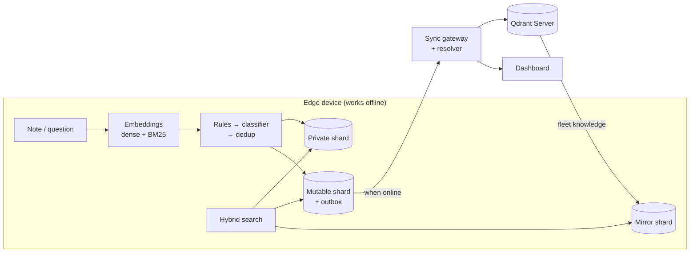

# Smaran — Project Proposal (Code Cubicle 6.0, PS3)

Sep 25, 2026 · @kanishka salgude

## 1. Executive summary

Smaran (Sanskrit for "recall") is an offline-first memory layer for AI on edge devices, built on Qdrant Edge. It decides what a device should keep private, what it should share with the cloud, and which version of a fact to believe when devices disagree.

> **Qdrant Edge gave devices a memory. Smaran makes that memory trustworthy offline.**

**The gap.** Qdrant Edge already handles local storage and search. PS3 asks for more: deciding what stays local, handling conflicting information, and a real edge-to-cloud workflow. Qdrant's own sync guide leaves all three to the developer.

**Our answer has three core parts, ordered from most to least deterministic:**

1. **Correct conflict handling.** Version vectors tell a *newer* fact apart from a *conflicting* one. Conflicts are flagged, never silently overwritten. Old facts are superseded, not deleted, so history comes for free.
2. **Selective, crash-safe sync.** A private shard that never syncs, a durable SQLite outbox, and a gateway that ignores duplicate sends. The most critical memories go first.
3. **Layered, measured judgment.** Hard privacy rules run first. A learned classifier then proposes private, sync or drop. That's Laya, fine-tuned on our own labelled notes, with a simpler embedding classifier as a fallback. We report its measured accuracy instead of assuming it.

**Demo:** a maintenance copilot for factory technicians where Wi-Fi is poor. Two devices go offline, record conflicting reports about the same machine and reconnect. Smaran catches the conflict instead of guessing.

### Scope decisions (v2)

This version cuts scope so four people can ship a demo that works reliably by 30 September. The core is now Qdrant Edge, hybrid search, the resolver, the outbox and gateway, the residency classifier and a three-view dashboard.

| Item | Before | Now | Why |
| --- | --- | --- | --- |
| Local LLM (Ollama) | Core | **Cut.** Show cited search results | PS3 judges retrieval; an LLM adds latency and a failure point |
| n8n alerts | Core | **Cut.** Conflict badge on the dashboard | One less container in the live demo |
| Dashboard | 6 views | **3 views** | Still covers every UI item in the PS |
| Laya | Fine-tune "if time" | **Accuracy test on day 1, fine-tune from day 2, fallback classifier** | Zero-shot accuracy is unproven, so judgment can't rest on it |
| Clocks | HLC + version vectors | **Version vectors + a simple counter** | Version vectors do the actual conflict detection |
| Mirror refresh | Partial snapshots | **Server scroll by version; snapshots only if the day-1 test passes** | Beta API risk |
| Live demo | 8 beats in sequence | **Recorded video first; 4 live beats, each with its own reset** | No single failure can cascade |
| Presidio, MCP, Jev, V-JEPA, consolidation | Stretch | **Future scope** | Not needed to answer PS3 |

**Why this is the floor, not just leaner.** Each remaining piece answers a named PS3 goal: shards for "what stays local," dense + BM25 for the hybrid search the PS asks for by name, the resolver for "conflicting information," the outbox and gateway for "synchronize when connectivity returns," the classifier for "dynamically decide," and the dashboard for the required UI. Removing any one drops a stated requirement. The remaining risk is execution speed on Thursday and Friday, which the gates in section 11 are built for.

## 2. Problem statement and root cause

Edge AI memory looks like a search problem, but the hard part is decisions: what to keep, what to share, and what to believe.

**The situation.** Robots, factory systems, kiosks, vehicles and phones increasingly run AI that must work without reliable internet. Connectivity is weak, latency matters, and sensitive data often can't leave the device. These devices still need to remember what happens, search it quickly, and stay in step with a central system.

**What PS3 asks for:**

- Searchable memory on the device, with fast vector and hybrid search offline.
- Deciding dynamically what stays local and what syncs.
- Working through intermittent connectivity, and syncing with Qdrant Server when it returns.
- Handling updates and conflicting information.
- A user interface to inspect memory, search, sync and activity.
- A meaningful edge-to-cloud workflow, *"rather than simply running a local vector database."*

**What already exists.** Qdrant Edge is an in-process vector search engine, which Qdrant calls "SQLite for vector search." Qdrant also publishes a reference sync pattern: write locally, queue the write, push it to the server, and pull indexed data back as a snapshot.

**What the reference pattern leaves open.** We read Qdrant's own sync guide closely:

| Gap | What the guide does | Why it matters |
| --- | --- | --- |
| What to sync | Writes every point to both the device and the server | Private data leaks; bandwidth is wasted |
| Durability | The sync queue lives in memory, and retries are left to the developer | A crash or reboot loses unsynced memories |
| Conflicts | Merges results by similarity score and dedups by point ID, using device wall-clock time | An older fact can win; clock skew corrupts order; two offline edits are never detected |
| Maintenance | Edge has no background optimizer | Search slows down unless something calls `optimize()` |

**Root cause.** Edge memory is really three problems stacked together:

1. **Governance.** Which memories are allowed to leave the device?
2. **Consistency.** When devices diverge offline, which version is true?
3. **Belief over time.** Facts change, so memory must track what was true *when*, not just store vectors.

Qdrant Edge solves storage and retrieval. Smaran solves these three.

## 3. Proposed solution overview

Smaran sits between the application and Qdrant Edge. Every memory passes through it on the way in, and every query on the way out.

**On the device (fully offline):**

- **Capture.** A technician's note or question comes in.
- **Understand.** The text becomes a dense embedding (meaning) and a sparse BM25 vector (keywords), both computed locally.
- **Decide, in layers.** First, PII rules force *private* if they match. Second, the residency classifier proposes *private*, *sync* or *drop*, plus a criticality level. That's Laya fine-tuned, or the embedding-classifier fallback, whichever scores higher on our test set. Third, a near-duplicate of fleet knowledge is dropped.
- **Store.** The memory goes into one of three Qdrant Edge shards: **Private** (never leaves), **Mutable** (waiting to sync) or **Mirror** (fleet knowledge from the cloud).
- **Answer.** Hybrid search runs across all three shards and returns only current facts. Each result shows its source, score and shard. If the best local score is below a threshold and the device is online, the query also goes to Qdrant Server, and useful results are cached in the mirror.

**Between device and cloud:**

- **Sync.** A crash-safe outbox sends memories most-critical-first when the connection returns.
- **Resolve.** The gateway runs the same conflict logic as the device. A newer version supersedes the old one. Concurrent versions are marked *contested*, kept side by side and flagged on the dashboard.
- **Share.** Each device refreshes its mirror from the server.

**For people:** a three-view dashboard, described in section 5.7.

## 4. Unique selling points

Smaran's core idea is that edge memory must stay *correct* offline, not just searchable. Each point below is something a typical "Qdrant Edge + chatbot + sync button" project won't have, and each is proven by something on screen.

| # | Unique point | What it means | How we prove it |
| --- | --- | --- | --- |
| 1 | **We fix a flaw in the reference pattern** | Qdrant's guide merges by similarity score, so a stale fact can win. Smaran merges by version | Side-by-side: naive merge shows the old status, Smaran shows the current one |
| 2 | **Conflict detection that's actually correct** | Version vectors tell "newer" apart from "written independently offline." Real conflicts are never silently overwritten | Two live devices disagree, and a 5-device randomized simulation passes; the system flags *contested* instead of guessing |
| 3 | **Privacy enforced by structure** | Private memories go to a shard that has no sync code path. PII rules override any model decision | Server audit query returns 0 personal records |
| 4 | **Crash-safe sync** | A durable SQLite outbox, and a gateway that ignores duplicate sends | Kill the device mid-sync, restart it, and nothing is lost or duplicated (in the video) |
| 5 | **History, not overwrite** | Facts are superseded with validity windows, never deleted | "What did device A believe at 10:05?" |
| 6 | **Criticality-first sync** | On a weak link, safety-critical memories go first | The safety note arrives before routine ones |
| 7 | **Layered judgment you can measure** | Rules, then a learned classifier (Laya or an embedding fallback), then version vectors. We publish the classifier's accuracy on our own test set | Accuracy table in the README: rules only vs embedding classifier vs Laya zero-shot vs Laya fine-tuned |
| 8 | **Explainable decisions** | Every choice (keep private, drop duplicate, escalate to cloud) is logged with its reason | The dashboard's decision log |
| 9 | **Cloud as backup, not crutch** | Queries answer locally unless local confidence is low and the device is online | Search view shows "answered locally" or "escalated" |

**One line for judges:** *other teams show that a device can remember; we show that its memory stays correct and private when devices go offline and disagree.*

**Why the core is deterministic.** 2026 research testing memory systems on conflicting facts found LLM-driven systems scoring as low as 7–18%. Its fix was to let AI identify candidates and let code decide using version metadata. Smaran follows the same principle: the model proposes, and code has the final word on privacy and truth.

## 5. System architecture

Smaran has three parts: the edge device, the sync gateway and the dashboard. The device never needs the other two to work.



A memory is embedded, judged and stored. Only the mutable shard ever syncs, and fleet knowledge comes back into the mirror.

### 5.1 The memory record

Every memory is a Qdrant point with two vectors (`dense`, `bm25`) and a payload:

| Field | Purpose |
| --- | --- |
| `entity_key` | What the fact is about, e.g. `machine:CNC-07/status` |
| `value`, `kind` | The content and its type |
| `device_id`, `author` | Where it came from |
| `vv` | Version vector: how many updates from each device this version has seen |
| `seq` | A per-device counter, used only for display order |
| `valid_from`, `valid_to`, `superseded_by`, `status` | Belief over time: current, superseded or contested |
| `decision` | Residency and criticality, with confidence and reason |

### 5.2 Three shards

Qdrant's documented pattern uses two shards. A third makes "what stays local" a structural guarantee, not a flag.

- **Private:** personal or sensitive memories. No code path syncs it.
- **Mutable:** new local memories. Every write also lands in the outbox.
- **Mirror:** read-only fleet knowledge from the server.

### 5.3 Residency router

For each new memory, in order:

1. **PII rule.** Phone numbers, emails and ID-like numbers force *private*.
2. **Classifier.** It proposes *private*, *sync* or *drop*, plus criticality (routine, important or safety-critical).
3. **Dedup.** If the memory nearly duplicates something in the mirror (cosine similarity above 0.95), it's dropped.
4. **Log.** The decision and its reason go to the decision log.

### 5.4 Belief resolver

When a memory arrives for an `entity_key` that already has a current value, Smaran compares version vectors:

- **The new one has seen everything the old one has:** the old one becomes *superseded*, with `valid_to` set. It isn't deleted.
- **Neither has seen the other:** they were written independently offline. Both become *contested*.

This is one small pure-Python function with unit tests. The same code runs on the device and the gateway, so both always agree.

### 5.5 Sync protocol

1. Each write goes to the mutable shard and the SQLite outbox together.
2. When online, batches go to the gateway, most critical first.
3. The gateway ignores any operation ID it has already seen, so retries are safe.
4. The gateway resolves conflicts, stores the result in Qdrant Server, and marks contested facts for the dashboard.
5. Devices refresh the mirror by reading server changes since their last known version. Qdrant Edge snapshots replace this only if our day-1 test shows they work.
6. Failed sends retry with backoff, and the outbox survives crashes.

### 5.6 Query path

1. Hybrid search runs across all three shards, dense and BM25, fused with Reciprocal Rank Fusion. Only `status = current` is shown by default.
2. Results are shown with their source, score and shard; there's no LLM in the loop.
3. If the best local score is below a threshold and the device is online, the query also goes to Qdrant Server.
4. The device calls Qdrant Edge's `optimize()` on an idle timer, because Edge has no background optimizer.

### 5.7 Dashboard (three views)

| View | Shows | PS requirement covered |
| --- | --- | --- |
| **Devices & sync** | Online/offline switch per device, outbox depth, last sync, server audit | Sync status, system activity |
| **Memory & search** | Memories per shard with status badges; search box with scores, latency and which shard answered; history slider | Device memory, search results |
| **Conflicts & decisions** | Contested facts side by side with a resolve button; decision log with reasons | Conflicting information, system activity |

## 6. AI models and offline operation

The MVP uses three small models, all open and CPU-friendly, downloaded once so the device works with Wi-Fi off. None of them is allowed to decide privacy or truth alone.

| Role | Model | Runs where | Status |
| --- | --- | --- | --- |
| Meaning search | FastEmbed `bge-small-en-v1.5` (384-dim) | Device, CPU | Core |
| Keyword search | FastEmbed `Qdrant/bm25` | Device | Core |
| Residency classifier, option A | [Laya](https://pypi.org/project/laya/) (Convai, Apache 2.0, 421M), fine-tuned on our notes | Device, CPU or ONNX | Core if it wins the day-2 test |
| Residency classifier, option B | Logistic regression on the same `bge-small` embeddings (scikit-learn) | Device, CPU | Guaranteed fallback |
| Answer writing | Small local LLM (Qwen via Ollama) | Device | Future scope |
| Cloud second opinion | [Jev](<https://en.wikipedia.org/wiki/Jev_(AI_model)>) (TypeSafe AI, hosted, early access) | Cloud only | Future scope |
| Visual memory | [V-JEPA 2.1](https://github.com/facebookresearch/vjepa2) ViT-B (80M) | Device | Future scope |

### 6.1 Why Laya, and why it isn't the whole story

Laya is an open 2026 "decision model." You give it text and typed questions (`choice`, `score` or `noul` yes/no), and it returns answers with probabilities in one forward pass. That fits residency decisions well: it's fast, offline and always returns a valid option.

```python
from laya import Router
router = Router()   # weights loaded from the local cache
result = router.predict(note, {
    "residency": {"type": "choice", "instructions": "Where should this memory live?",
                  "criteria": {"private": "personal info, names, phone numbers",
                               "sync": "machine facts and fixes useful to others",
                               "drop": "chit-chat or no useful information"}},
    "criticality": {"type": "score", "instructions": "How critical for safety or uptime?",
                    "criteria": ["routine", "important", "safety-critical"]}})
```

**The accuracy problem.** The only public figures are on Laya's own typed-decisions benchmark: about 0.36 zero-shot and 0.77 fine-tuned, as reported by [AI Weekly](https://aiweekly.co/alerts/convai-ships-laya-a-421m-modernbert-decision-model-apache-20). That benchmark isn't our task, but it's a clear warning. If our task behaves similarly, zero-shot Laya on a three-way choice would be close to random guessing (0.33). So we don't assume anything; we measure.

**The plan:**

1. **Thursday:** label 300 factory notes as private, sync or drop, plus criticality. A script generates 200 from templates (machines × symptoms × fixes, plus notes with names and phone numbers). C and D write 100 by hand. This work doesn't depend on Qdrant Edge, so a slow spike can't block it.
2. **Label quality check, before any number is trusted:**
   - The 60-note test set is taken **only from the hand-written notes**, so templates can't leak phrasing into the test.
   - C and D label those 60 **independently**, and we compute their agreement (Cohen's kappa). Disagreements are discussed and settled, and ambiguous notes are dropped.
   - Agreement goes in the README next to the accuracy table. If it's below about 0.7, the task itself is ambiguous, so we tighten the label definitions before trusting any model score.
3. **Friday morning:** run the baselines on the test set: rules only, embedding classifier and Laya zero-shot. The embedding classifier trains in seconds on a CPU.
4. **Friday, 3-hour hard cap:** fine-tune the `laya-typed-decisions` checkpoint on the other 240 notes, on the gaming laptop's GPU (Colab as backup). If it isn't done by the cap, we stop.
5. **Friday, 6 pm gate:** ship whichever classifier scores higher on the test set. Both sit behind the same `ResidencyClassifier` interface, so switching is one line.
6. **README:** publish every number we got, including a failed or skipped fine-tune and the label agreement score.

This turns the weak point into a strength: the "judgment" claim rests on a measured result and a safety net, not on an untested library.

### 6.2 Offline guarantee

- A setup script downloads the FastEmbed models and the Laya weights once.
- The device runs with `HF_HUB_OFFLINE=1` and local model paths.
- Qdrant Edge runs inside the app process, with no server.
- The offline switch is a software flag in the device API, so the demo doesn't depend on toggling real Wi-Fi. We still run one full test with Wi-Fi physically off.

## 7. Tech stack

The MVP has nine moving parts, down from fourteen. Python runs the device and gateway, React runs the dashboard, and Docker Compose starts everything with one command.

| Layer | Technology | Role |
| --- | --- | --- |
| Edge vector database | Qdrant Edge (`qdrant-edge-py`, version pinned; it's in beta) | Local memory and search, inside the app |
| Embeddings | FastEmbed: `bge-small-en-v1.5` + `Qdrant/bm25` | Dense and sparse vectors on the device |
| Residency classifier | Laya (fine-tuned) or scikit-learn logistic regression | Private / sync / drop, plus criticality |
| Local durability | SQLite | Outbox and decision log |
| Device API | FastAPI | One process per simulated device, with an online/offline flag |
| Cloud database | Qdrant Server (Docker) | Fleet knowledge |
| Sync gateway | FastAPI | Idempotent ingest and conflict resolution |
| Dashboard | React (Vite), Tailwind, shadcn/ui | Three views |
| Packaging | Docker Compose + `demo.sh` | One-command setup, demo and per-beat reset |

**Repository layout:** `device/` (shards, embeddings, classifier, rules, resolver, outbox), `gateway/`, `dashboard/`, `bench/`, `data/labelled_notes.csv`, `models/` (downloaded weights, not committed), `docker-compose.yml`, `demo.sh` and `README.md`.

## 8. Use case and demo

The demo is a maintenance copilot for factory technicians. A shop floor produces every hard case PS3 lists: poor Wi-Fi, private notes, shared machine knowledge and conflicting reports.

**Who uses it:**

- **Technicians** carry a tablet. They log observations and fixes, and search questions like "CNC-07 bearing trouble."
- **The supervisor** watches the dashboard and resolves conflicts.

**Why this vertical:** Qdrant counts Bosch among its customers and investors, so industrial edge AI is close to what the sponsor cares about.

### 8.1 Recorded video (the primary submission)

A 3-minute video covers the full story, recorded on Monday with retakes allowed:

1. Two devices start and pull machine manuals into their mirrors.
2. Offline, Tech A logs "CNC-07 bearing replaced, vibration normal" and Tech B logs "CNC-07 still vibrating at high RPM." Both search locally in milliseconds.
3. Tech A logs a note with a phone number. The decision log shows it stayed private and why.
4. Side-by-side: a naive score-based merge shows the stale status, and Smaran shows the current one.
5. Reconnect. The safety-critical note syncs first. CNC-07 is marked *contested*, and the supervisor resolves it.
6. The history slider shows what each device believed at 10:05.
7. A device is killed mid-sync and restarted. The outbox finishes, with no duplicates and zero personal records on the server.
8. Metrics screen.

### 8.2 Live demo (if selected for the offline round)

Only four beats run live. Each starts from `./demo.sh reset <beat>`, which loads a known state in a few seconds, so one failure can't cascade into the next.

| Beat | What happens live | Proves |
| --- | --- | --- |
| 1 | Flip a device offline in the dashboard; write a note and search it | Offline memory and fast search |
| 2 | Write a note with a phone number; show the decision log and the empty server audit | Privacy on the device |
| 3 | Two offline devices write conflicting notes; flip both online; *contested* appears | Correct conflict detection |
| 4 | Resolve the conflict; drag the history slider | Belief over time |

The offline switch is a software flag, not real Wi-Fi, and everything runs on one laptop with no venue internet needed. The crash test and criticality ordering stay in the video, where retakes are possible.

## 9. Comparison with existing approaches

No single existing option combines offline operation, privacy decisions and correct conflict handling. Smaran is built to do all three.

| Capability | Local vector DB only | Qdrant's reference sync pattern | Cloud memory layers (Mem0, Zep) | **Smaran** |
| --- | --- | --- | --- | --- |
| Works offline | Yes | Yes | No, they need a server | **Yes** |
| Hybrid search on device | Depends | Possible | Not on device | **Yes, dense + BM25 with RRF** |
| Decides what stays local | No | No, everything syncs | No | **Yes, rules plus a measured classifier** |
| Survives crashes mid-sync | n/a | No, the queue is in memory | n/a | **Yes, SQLite outbox + idempotent gateway** |
| Detects concurrent offline edits | No | No | No | **Yes, version vectors** |
| Keeps history of changed facts | No | No | Zep does (validity windows); Mem0 overwrites | **Yes, bi-temporal** |
| Explains its decisions | No | No | Partly | **Yes, a decision log with reasons** |
| Sync priority | No | No, first in first out | n/a | **Yes, criticality first** |

"n/a" means the approach has no sync step to fail. The Qdrant column describes the pattern in its sync guide, not a limitation of Qdrant Edge itself, and Smaran is built on that same engine.

## 10. Evaluation metrics

One script, `bench.py`, produces five numbers for the README and the video. The targets are goals, not results yet, and we publish whatever we measure.

| Metric | How we measure it | Target |
| --- | --- | --- |
| Offline search latency, p50 / p95 | 1,000 hybrid queries on local shards, offline | Under 20 ms / 50 ms |
| Residency accuracy | 60 held-out labelled notes: rules only vs embedding classifier vs Laya zero-shot vs Laya fine-tuned | Report all four; ship the best |
| Conflict accuracy | 50 scripted cases (updates and concurrent edits): Smaran resolver vs naive score-based merge | Resolver 100%; show where the naive merge fails |
| Multi-device convergence | 1,000 random runs of a 5-device simulation: random offline edits, random delivery order, duplicate sends | Every replica ends in the same state; no concurrent edit is lost |
| Bandwidth saved | The same 500-note script with Smaran vs sync-everything | At least 40% fewer bytes |
| Personal data on the server | Audit query after the demo run | 0 records |

## 11. Implementation plan

Feature freeze is Saturday night, a day earlier than before. Sunday is integration and rehearsal only, Monday is the video plus a buffer, and we submit by noon on Tuesday 30 September. Each day ends with a go/no-go gate, so a problem shows up early instead of on Monday.

**Roles:** A = edge core, B = sync and cloud, C = dashboard, D = classifier, benchmarks and demo.

| Day | A · Edge core | B · Sync & cloud | C · Dashboard | D · Classifier & demo | Gate at end of day |
| --- | --- | --- | --- | --- | --- |
| Thu 25 | **Spike only, 3-hour timebox:** install `qdrant-edge-py`; create, upsert, query, close; try snapshots. Then three shards + schema | Repo, Docker Compose with Qdrant Server. **If A's spike overruns, B joins A** | App shell (1 hour), then **helps D label** | **Labelling only:** script generates 200 notes; C and D write 100 and review all 300 | Edge works on our hardware? 300 labelled notes exist? |
| Fri 26 | Dense + BM25, RRF, current-only filter; **SQLite outbox** (device-side, so it moves to A) | **Resolver + its unit tests only** | Memory & search view, then Devices & sync view against the mock API | **Morning:** double-label check, then baselines. **Fine-tune: 3-hour hard cap.** Afternoon: **5-device simulation** in `bench.py` | Classifier chosen by 6 pm; resolver tests pass by 4 pm |
| Sat 27 | Residency router wired in; dedup; cloud fallback by score | Idempotent `/sync`, mirror refresh, contested flow | **Morning:** conflicts & decisions view on mock API. **Afternoon:** wire all 3 views to real APIs | `demo.sh` with per-beat reset | **Full story runs once → feature freeze** |
| Sun 28 | Bug bash (demo-blocking bugs only) | Crash test; duplicate-send test | Polish, empty and error states | Run the demo 10 times, log failures; **draft README**; **record a backup video take at night** | 10 runs logged; backup video exists |
| Mon 29 | Fix demo-blocking bugs until 2 pm, then stop | Same | Screenshots | Record the final video after 2 pm; finish README | Video and README done |
| Tue 30 | — | — | — | Submit by noon; LinkedIn posts | **Submitted** |

B's Friday is now one deliverable. The outbox moved to A, who owns the device code, and the 5-device simulation moved to D, since it's a test harness that belongs in `bench.py`. C builds every view against the mock API first, so Saturday afternoon is only wiring, not building.

**Who jumps in, by name:**

| If this runs long | Who helps | What slides |
| --- | --- | --- |
| A's Edge spike (Thursday, past 3 hours) | B | B's Docker setup moves to Thursday night |
| B's resolver (Friday, tests not passing by 4 pm) | A, after RRF is done | RRF polish and the current-only filter move to Saturday morning |
| D's fine-tune (Friday, 3-hour cap hit) | Nobody; it stops | Fallback classifier ships |
| C's views (Saturday, not wired by 3 pm) | D, after `demo.sh` | Polish moves to Sunday |
| B's sync (Saturday night, not solid) | A and B together | "Sync now" button replaces automatic sync |

**If a gate fails:**

- **Edge spike passes 3 hours without a working upsert and query:** B joins A for the rest of Thursday, and we post in the Qdrant mentor channel that hour. Labelling isn't affected, because it doesn't depend on Edge.
- **Snapshots don't work:** refresh the mirror by server scroll (already the default).
- **Fine-tune hits its 3-hour cap** (Colab disconnects, GPU memory errors, no convergence): stop, ship the embedding classifier, and report Laya zero-shot as the comparison. No second attempt before submission.
- **Fine-tuned Laya loses to the fallback:** ship the fallback; keep Laya's numbers in the README.
- **Sync isn't solid by Saturday night:** replace automatic sync with a "Sync now" button for the demo.
- **Sunday rehearsal finds bugs:** fix only the ones that break a demo beat. Everything else goes into the README's "Known limitations" section. Monday bug-fixing stops at 2 pm, and the Sunday backup take is the fallback video.

**We never cut:** the resolver, the outbox, the private shard or the offline switch. Each is under 200 lines of plain Python, and together they're the answer to PS3.

## 12. Risks, impact and future scope

### Risks and fallbacks

| Risk | Likelihood | Mitigation |
| --- | --- | --- |
| Qdrant Edge beta spike eats Thursday | **High** | 3-hour timebox, then B joins; labelling runs in parallel and doesn't depend on Edge; ask Qdrant mentors the same hour |
| Snapshot sync is fiddly | Medium | Mirror refresh by server scroll is the default; snapshots are optional |
| Laya is inaccurate on our task | High | Measured Friday morning; embedding-classifier fallback; PII rules override any model |
| Fine-tuning burns hours (Colab disconnects, GPU memory) | **High** | 3-hour hard cap, no second attempt; the 6 pm gate picks a classifier regardless |
| Laya is slow on CPU | Medium | ONNX build and batching; the fallback takes under 1 ms |
| Resolver only proven with 2 devices | Medium | 5-device randomized simulation in `bench.py`; answer for N devices ready for judges (below) |
| Sunday rehearsal eats Monday | Medium | Only demo-blocking bugs get fixed; bug-fixing stops Monday 2 pm; Sunday-night backup video |
| Live demo breaks mid-way | Medium | Recorded video is the primary; 4 live beats, each with its own reset; software offline switch |
| Team member unavailable | Medium | Each role's core is under 200 lines; daily sync so someone can pick it up |

**If a judge asks about three or more devices.** Version vectors carry one counter per device, so the same comparison works for any number of devices. With N devices offline, any pair that never saw each other's edits is flagged *contested*, and the gateway keeps every contested version, not just two. The randomized 5-device simulation checks exactly this. Its known limit: a version vector grows by one entry per device, which is fine for a factory fleet of tens of devices but would need pruning at thousands.

### Impact

- **Safety and uptime:** critical machine knowledge reaches every technician first, even over a weak link.
- **Privacy by default:** personal data stays on the device, which suits laws like India's DPDP Act.
- **Trust:** decisions are explained, and conflicts are shown to people instead of being guessed away.
- **Cost:** syncing less saves bandwidth and cloud storage.

### Other places the same engine fits

- **ASHA and rural health workers:** patient notes stay on the phone, and anonymised health trends sync.
- **Retail kiosks and ticket machines:** local answers, with fleet-wide learning.
- **Vehicles and delivery fleets:** road and route notes shared when a depot's Wi-Fi is in range.
- **Robots and drones:** local episodic memory, with visual memory using V-JEPA.

### Future scope (deliberately out of the MVP)

- **Answer writing:** a small local LLM (Qwen via Ollama) that writes answers from cited memories.
- **Cloud second opinion:** Jev on the gateway for contested facts, behind the same classifier interface.
- **Visual memory:** V-JEPA 2.1 embeddings for camera clips, storing only novel moments.
- **Agent access:** an MCP server exposing `remember`, `recall` and `resolve`.
- **Automation:** n8n or voice alerts to supervisors about contested facts.
- **Consolidation:** merging near-duplicates and retiring stale memories while idle.
- **Stronger privacy:** Microsoft Presidio for names and addresses.
- **Mobile:** a native app on Qdrant Edge's Rust core.
- **Smarter merges:** CRDT-based merging for free-text memories, and flags for dependent memories that may be stale.

## Sources

- Code Cubicle 6.0 problem statements (PDF in the project)
- Qdrant Edge: [overview](https://qdrant.tech/documentation/edge/), [quickstart](https://qdrant.tech/documentation/edge/edge-quickstart/), [API reference](https://qdrant.tech/documentation/edge/edge-api/)
- Laya: [PyPI](https://pypi.org/project/laya/), [guide](https://www.madewithlaya.com/guides/what-is-laya), [AI Weekly on accuracy and speed](https://aiweekly.co/alerts/convai-ships-laya-a-421m-modernbert-decision-model-apache-20)
- Jev: [Wikipedia](<https://en.wikipedia.org/wiki/Jev_(AI_model)>), [Simon Willison](https://simonwillison.net/2026/Sep/21/jev/)
- V-JEPA 2 / 2.1: [GitHub](https://github.com/facebookresearch/vjepa2)
- Earlier research notes in the project: `research/01-initial-research-ps3-smaran.md` and `research/02-ps3-winning-strategy-smaran.md`
